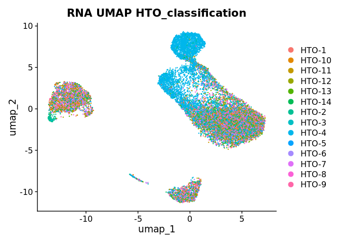
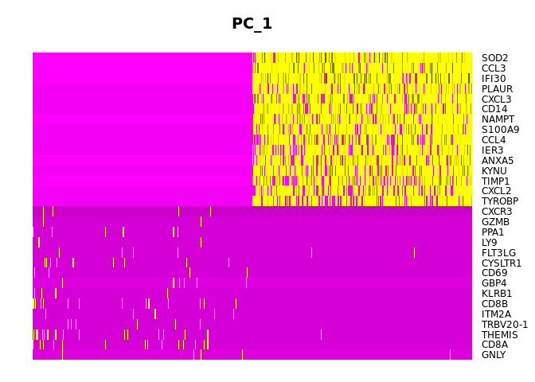
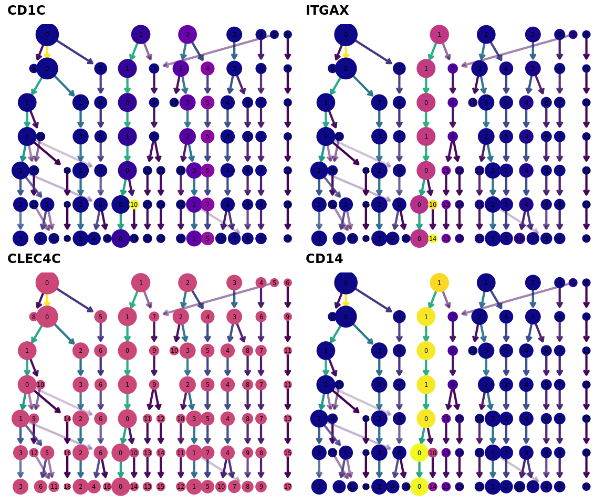
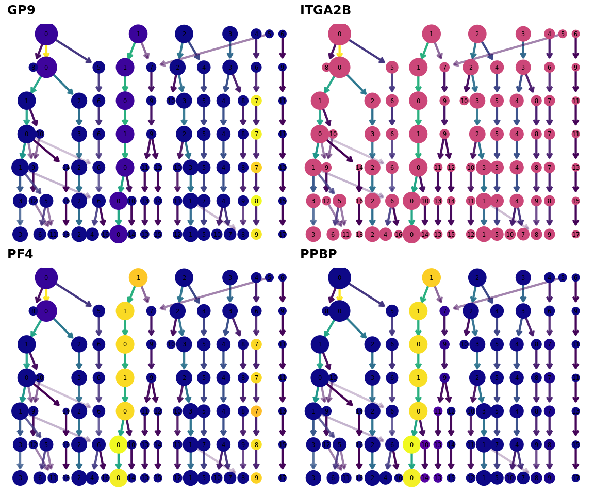

This script is a test script to work with 20250616_benchmark sample to set up a pipeline. It will explore the seurat file, plot and save various plots and determine the QC metrics for both PBMC and T cell sorted populations. 
However, to save the processed seurat object, should run as abatch script, found ~/R/scCHANTS/script_1.11_save_processed_20250616_pbmc_rds.R or ~/R/scCHANTS/script_1.11_save_processed_20250616_pbmc_rds.R

* unzip files
* load into a seurat object
* (in future scripts will need to do data integration)
* filter and quality control
* normalisation
* (batch effect correction)
* feature selection
* dimensionality reduction
* export Rds file

Before running bear in mind all plots will automatically be saved, I recommend copying plots to your OneDrive folder as you generate them in case of overwriting (though they should be the same!)
Can also search for " ggsave" and replace with "#ggsave" or vice versa

# Script 1.1a Load into R and HTO demultiplex

# Load packages

``` r
library("R.utils")    # need for decompressing files
```

```
## Loading required package: R.oo
```

```
## Loading required package: R.methodsS3
```

```
## R.methodsS3 v1.8.2 (2022-06-13 22:00:14 UTC) successfully loaded. See ?R.methodsS3 for help.
```

```
## R.oo v1.27.0 (2024-11-01 18:00:02 UTC) successfully loaded. See ?R.oo for help.
```

```
## 
## Attaching package: 'R.oo'
```

```
## The following object is masked from 'package:R.methodsS3':
## 
##     throw
```

```
## The following objects are masked from 'package:methods':
## 
##     getClasses, getMethods
```

```
## The following objects are masked from 'package:base':
## 
##     attach, detach, load, save
```

```
## R.utils v2.12.3 (2023-11-18 01:00:02 UTC) successfully loaded. See ?R.utils for help.
```

```
## 
## Attaching package: 'R.utils'
```

```
## The following object is masked from 'package:utils':
## 
##     timestamp
```

```
## The following objects are masked from 'package:base':
## 
##     cat, commandArgs, getOption, isOpen, nullfile, parse, warnings
```

``` r
library("dplyr")
```

```
## 
## Attaching package: 'dplyr'
```

```
## The following objects are masked from 'package:stats':
## 
##     filter, lag
```

```
## The following objects are masked from 'package:base':
## 
##     intersect, setdiff, setequal, union
```

``` r
library("Seurat")
```

```
## Loading required package: SeuratObject
```

```
## Loading required package: sp
```

```
## 
## Attaching package: 'SeuratObject'
```

```
## The following objects are masked from 'package:base':
## 
##     intersect, t
```

``` r
library("ggplot2")
library("clustree")
```

```
## Loading required package: ggraph
```

```
## 
## Attaching package: 'ggraph'
```

```
## The following object is masked from 'package:sp':
## 
##     geometry
```

``` r
library("patchwork")
library("viridis")
```

```
## Loading required package: viridisLite
```

# Create file path for saving plots
Must create this directory and sub-directories e.g. demultiplex, QC, PCA, others

``` r
file_path <- "/cephfs/volumes/hpc_data_prj/id_hill_sims_wellcda/c1947608-5b3a-4d60-8179-b8e0779d7319/scratch_tmp/scCHANTS/20250616_benchmark/plots"
```


# Decompress the files

``` r
# only need to do once
# gunzip("/cephfs/volumes/hpc_data_prj/id_hill_sims_wellcda/c1947608-5b3a-4d60-8179-b8e0779d7319/scratch_tmp/scCHANTS/20250616_benchmark/20250616_benchmark/matrix.mtx.gz", temporary = TRUE, remove = FALSE)
# gunzip("/cephfs/volumes/hpc_data_prj/id_hill_sims_wellcda/c1947608-5b3a-4d60-8179-b8e0779d7319/scratch_tmp/scCHANTS/20250616_benchmark/20250616_benchmark/barcodes.tsv.gz", temporary = TRUE, remove = FALSE)
# gunzip("/cephfs/volumes/hpc_data_prj/id_hill_sims_wellcda/c1947608-5b3a-4d60-8179-b8e0779d7319/scratch_tmp/scCHANTS/20250616_benchmark/20250616_benchmark/features.tsv.gz", temporary = TRUE, remove = FALSE)
```

# Load data

``` r
# load the unzipped files
# gene.column = 2 gives gene symbol/name instead of ENSEMBL ID
scCHANTS_data <- Read10X(data.dir = "/cephfs/volumes/hpc_data_prj/id_hill_sims_wellcda/c1947608-5b3a-4d60-8179-b8e0779d7319/scratch_tmp/scCHANTS/20250616_benchmark/20250616_benchmark/", gene.column=2)
```

```
## 10X data contains more than one type and is being returned as a list containing matrices of each type.
```

``` r
# create seurat object
# could add arguments for min.cells or min.features to be included
scCHANTS <- CreateSeuratObject(counts = scCHANTS_data, project = "scCHANTS")

Assays(scCHANTS)
```

```
## [1] "RNA"
```

``` r
Layers(scCHANTS[["RNA"]])
```

```
## [1] "counts.Gene Expression"  "counts.Antibody Capture"
```

## Rename HTO and ADT ids

``` r
# add HTO and ADT assay to the seurat object as it is by default ignored by CreateSeuratObject
# extract feature names
HTO_names <- rownames(scCHANTS_data$`Antibody Capture`) [1:14]
ADT_names <- rownames(scCHANTS_data$`Antibody Capture`) [15:18]

# extract count matrices
HTO_counts <- scCHANTS_data$`Antibody Capture` [HTO_names, , drop=FALSE]
ADT_counts <- scCHANTS_data$`Antibody Capture` [ADT_names, , drop=FALSE]

# check names and order
rownames(HTO_counts)
```

```
##  [1] "TotalSeq™-C0251 anti-human Hashtag 1 Antibody" 
##  [2] "TotalSeq™-C0252 anti-human Hashtag 2 Antibody" 
##  [3] "TotalSeq™-C0253 anti-human Hashtag 3 Antibody" 
##  [4] "TotalSeq™-C0254 anti-human Hashtag 4 Antibody" 
##  [5] "TotalSeq™-C0255 anti-human Hashtag 5 Antibody" 
##  [6] "TotalSeq™-C0256 anti-human Hashtag 6 Antibody" 
##  [7] "TotalSeq™-C0257 anti-human Hashtag 7 Antibody" 
##  [8] "TotalSeq™-C0258 anti-human Hashtag 8 Antibody" 
##  [9] "TotalSeq™-C0259 anti-human Hashtag 9 Antibody" 
## [10] "TotalSeq™-C0260 anti-human Hashtag 10 Antibody"
## [11] "TotalSeq™-C0296 anti-human Hashtag 11 Antibody"
## [12] "TotalSeq™-C0262 anti-human Hashtag 12 Antibody"
## [13] "TotalSeq™-C0263 anti-human Hashtag 13 Antibody"
## [14] "TotalSeq™-C0264 anti-human Hashtag 14 Antibody"
```

``` r
rownames(ADT_counts)
```

```
## [1] "TotalSeq-C anti human CD14 (clone M5E2, cat 301859)"            
## [2] "TotalSeq-C anti human CD16 (clone 3G8 cat 302065)"              
## [3] "TotalSeq™-C0045 anti-human CD4 Antibody (clone SK3, cat 344651)"
## [4] "TotalSeq™-C0046 anti-human CD8 Antibody (clone SK1, cat 344753)"
```

``` r
# create mapping from long to short names. using - not _ as cannot have underscores in seurat object names
name_to_id <- c(
  "TotalSeq™-C0251 anti-human Hashtag 1 Antibody"  = "HTO-1",
  "TotalSeq™-C0252 anti-human Hashtag 2 Antibody"  = "HTO-2",
  "TotalSeq™-C0253 anti-human Hashtag 3 Antibody"  = "HTO-3",
  "TotalSeq™-C0254 anti-human Hashtag 4 Antibody"  = "HTO-4",
  "TotalSeq™-C0255 anti-human Hashtag 5 Antibody"  = "HTO-5",
  "TotalSeq™-C0256 anti-human Hashtag 6 Antibody"  = "HTO-6",
  "TotalSeq™-C0257 anti-human Hashtag 7 Antibody"  = "HTO-7",
  "TotalSeq™-C0258 anti-human Hashtag 8 Antibody"  = "HTO-8",
  "TotalSeq™-C0259 anti-human Hashtag 9 Antibody"  = "HTO-9",
  "TotalSeq™-C0260 anti-human Hashtag 10 Antibody" = "HTO-10",
  "TotalSeq™-C0296 anti-human Hashtag 11 Antibody" = "HTO-11",
  "TotalSeq™-C0262 anti-human Hashtag 12 Antibody" = "HTO-12",
  "TotalSeq™-C0263 anti-human Hashtag 13 Antibody" = "HTO-13",
  "TotalSeq™-C0264 anti-human Hashtag 14 Antibody" = "HTO-14",
  
  # ADTs
  "TotalSeq-C anti human CD14 (clone M5E2, cat 301859)"             = "ADT-CD14",
  "TotalSeq-C anti human CD16 (clone 3G8 cat 302065)"               = "ADT-CD16",
  "TotalSeq™-C0045 anti-human CD4 Antibody (clone SK3, cat 344651)" = "ADT-CD4",
  "TotalSeq™-C0046 anti-human CD8 Antibody (clone SK1, cat 344753)" = "ADT-CD8"
)

# rename the rows (features) using the mapping
rownames(HTO_counts) <- unname(name_to_id[rownames(HTO_counts)])
rownames(ADT_counts) <- unname(name_to_id[rownames(ADT_counts)])

# check names have changed
rownames(HTO_counts)
```

```
##  [1] "HTO-1"  "HTO-2"  "HTO-3"  "HTO-4"  "HTO-5"  "HTO-6"  "HTO-7"  "HTO-8" 
##  [9] "HTO-9"  "HTO-10" "HTO-11" "HTO-12" "HTO-13" "HTO-14"
```

``` r
rownames(ADT_counts)
```

```
## [1] "ADT-CD14" "ADT-CD16" "ADT-CD4"  "ADT-CD8"
```

## Add HTO and ADT assays to seurat object

``` r
# add HTO assay
scCHANTS[["HTO"]] <- CreateAssayObject(counts = HTO_counts)

# add ADT assay
scCHANTS[["ADT"]] <- CreateAssayObject(counts = ADT_counts)

# validate assays were added
Assays(scCHANTS)
```

```
## [1] "RNA" "HTO" "ADT"
```

``` r
# validate layers
Layers(scCHANTS)
```

```
## [1] "counts.Gene Expression"  "counts.Antibody Capture"
```


``` r
# check default assay
DefaultAssay(scCHANTS)
```

```
## [1] "RNA"
```

``` r
# if needed, can change default assay
DefaultAssay(scCHANTS) <- "RNA"

# check number of cells (samples) and features looks right
scCHANTS@assays$RNA
```

```
## Assay (v5) data with 38624 features for 18182 cells
## First 10 features:
##  DDX11L2, MIR1302-2HG, FAM138A, ENSG00000290826, OR4F5, ENSG00000238009,
## ENSG00000239945, ENSG00000239906, ENSG00000241860, ENSG00000241599 
## Layers:
##  counts.Gene Expression, counts.Antibody Capture
```

``` r
scCHANTS@assays$HTO
```

```
## Assay data with 14 features for 18182 cells
## First 10 features:
##  HTO-1, HTO-2, HTO-3, HTO-4, HTO-5, HTO-6, HTO-7, HTO-8, HTO-9, HTO-10
```

``` r
scCHANTS@assays$ADT
```

```
## Assay data with 4 features for 18182 cells
## First 4 features:
##  ADT-CD14, ADT-CD16, ADT-CD4, ADT-CD8
```

``` r
# free space
rm(scCHANTS_data)
```


# Demulitplex HTOs
For 20250616 data, there is shallow sequencing depth which is resulting in low read cutoffs (2-18, would expect >100), flattened ridgeplots (expect a clear bimodal distribution at 0 and positives not shallow enrichment curves) and (when normalised across cells) low negative calling. Also shown by low peak of total HTO counts per cell histogram
Should check in future experiments whether to normalise across features or cells (use margin argument)

https://satijalab.org/seurat/articles/hashing_vignette

HTODemux:

* Perform a k-medoid clustering on the normalized HTO values, which initially separates cells into K(# of samples)+1 clusters.
* Calculate a ‘negative’ distribution for HTO. For each HTO, the cluster with the lowest average value is used as the negative group.
* For each HTO, fit a negative binomial distribution to the negative cluster. 0.99 quantile of this distribution is used as a threshold.
* Based on these thresholds, each cell is classified as positive or negative for each HTO.
* Cells that are positive for more than one HTOs are annotated as doublets.


``` r
DefaultAssay(scCHANTS) <- "HTO"

# normalise HTO counts, standard is centered log-ratio (CLR) transformation
# can normalise across features (margin = 1) or across cells (margin = 2)
# comment on github forum satija lab says they recommend normalising across tags if variation between hash performances but since have very low signals, will try across cells
scCHANTS <- NormalizeData(scCHANTS, assay = "HTO", normalization.method = "CLR", margin = 2)
```

```
## Normalizing across cells
```

``` r
# using default threshold (quantile of inferred negative distribution for each hashtag), default kfunc is clara (for fast k-medoids clustering on large applications, it is faster and more memory-efficient as it repeatedly samples subsets and clusters those)
scCHANTS <- HTODemux(scCHANTS, assay = "HTO", positive.quantile = 0.99, kfunc = "clara")
```

```
## As of Seurat v5, we recommend using AggregateExpression to perform pseudo-bulk analysis.
## This message is displayed once per session.
```

```
## First group.by variable `ident` starts with a number, appending `g` to ensure valid variable names
## Cutoff for HTO-1 : 18 reads
## 
## Cutoff for HTO-2 : 3 reads
## 
## Cutoff for HTO-3 : 15 reads
## 
## Cutoff for HTO-4 : 15 reads
## 
## Cutoff for HTO-5 : 2 reads
## 
## Cutoff for HTO-6 : 7 reads
## 
## Cutoff for HTO-7 : 3 reads
## 
## Cutoff for HTO-8 : 13 reads
## 
## Cutoff for HTO-9 : 3 reads
## 
## Cutoff for HTO-10 : 2 reads
## 
## Cutoff for HTO-11 : 14 reads
## 
## Cutoff for HTO-12 : 3 reads
## 
## Cutoff for HTO-13 : 15 reads
## 
## Cutoff for HTO-14 : 11 reads
## 
## This message is displayed once every 8 hours.
```

## Visualise demultiplexing

``` r
DefaultAssay(scCHANTS) <- "HTO"

# look at classification
table(scCHANTS$HTO_classification.global)
```

```
## 
##  Doublet Negative  Singlet 
##     2485       25    15672
```

``` r
## check most are singlets

# visualise enrichment for some HTOs, group cells based on the max HTO signal
d1 <- RidgePlot(scCHANTS, assay = "HTO", features = rownames(scCHANTS[["HTO"]])[1:4], ncol = 2, group.by = "HTO_maxID")
d1
```

```
## Picking joint bandwidth of 0.0121
```

```
## Picking joint bandwidth of 0.0101
```

```
## Picking joint bandwidth of 0.00969
```

```
## Picking joint bandwidth of 0.0603
```

<!-- -->

``` r
# ggsave("HTO_1to4_ridgeplot.png", plot = d1, device = png, height = 25, width = 30, unit = "cm", path = paste0(file_path, "/demultiplex/") )
```


``` r
# look at pairs to see if mutually exclusive
d2 <- FeatureScatter(scCHANTS, feature1 = "HTO-1", feature2 = "HTO-2")
d2
```

<!-- -->

``` r
# ggsave("HTO_1vs2_featureplot.png", plot = d2, device = png, height = 10, width = 15, unit = "cm", bg = "white", path = paste0(file_path, "/demultiplex/") )

# compare number UMIs
d3 <- VlnPlot(scCHANTS, features = "nCount_RNA", pt.size = 0.1, log = TRUE, group.by = "HTO_classification.global")
d3
```

<!-- -->

``` r
# ggsave("HTO_nCount_RNA.png", plot = d3, device = png, height = 10, width = 18, unit = "cm", path = paste0(file_path, "/demultiplex/") )
```


``` r
# first remove negative cells from the object
scCHANTS_nonegs <- subset(scCHANTS, subset = HTO_classification.global != "Negative")
DefaultAssay(scCHANTS) <- "RNA"

# should check numbers of cells after subsetting as does not always subset every assay
length(Cells(scCHANTS))
```

```
## [1] 18182
```

``` r
length(Cells(scCHANTS_nonegs))
```

```
## [1] 18157
```

``` r
length(Cells(scCHANTS_nonegs[["RNA"]]))
```

```
## [1] 18157
```

``` r
length(Cells(scCHANTS_nonegs[["HTO"]]))
```

```
## [1] 18157
```

``` r
length(Cells(scCHANTS_nonegs[["ADT"]]))
```

```
## [1] 18157
```

``` r
## e.g. if counts.Gene Expression and counts.Antibody Capture are removed then RNA layer is no longer subsetted

# calculate a tSNE embedding of the HTO data
DefaultAssay(scCHANTS_nonegs) <- "HTO"

scCHANTS_nonegs <- ScaleData(scCHANTS_nonegs, features = rownames(scCHANTS_nonegs), verbose = TRUE)
```

```
## Centering and scaling data matrix
```

``` r
scCHANTS_nonegs <- RunPCA(scCHANTS_nonegs, features = rownames(scCHANTS_nonegs), approx = FALSE)
```

```
## Warning: Requested number is larger than the number of available items (14).
## Setting to 14.
## Warning: Requested number is larger than the number of available items (14).
## Setting to 14.
## Warning: Requested number is larger than the number of available items (14).
## Setting to 14.
## Warning: Requested number is larger than the number of available items (14).
## Setting to 14.
## Warning: Requested number is larger than the number of available items (14).
## Setting to 14.
```

```
## PC_ 1 
## Positive:  HTO-4, HTO-6, HTO-8, HTO-3, HTO-10, HTO-1, HTO-11 
## Negative:  HTO-13, HTO-14, HTO-12, HTO-5, HTO-7, HTO-2, HTO-9 
## PC_ 2 
## Positive:  HTO-4, HTO-13, HTO-14, HTO-12, HTO-6, HTO-9, HTO-8 
## Negative:  HTO-7, HTO-11, HTO-2, HTO-5, HTO-1, HTO-10, HTO-3 
## PC_ 3 
## Positive:  HTO-9, HTO-8, HTO-6, HTO-7, HTO-12, HTO-10, HTO-14 
## Negative:  HTO-1, HTO-11, HTO-5, HTO-2, HTO-3, HTO-13, HTO-4 
## PC_ 4 
## Positive:  HTO-5, HTO-7, HTO-8, HTO-14, HTO-3, HTO-4, HTO-13 
## Negative:  HTO-6, HTO-12, HTO-10, HTO-11, HTO-9, HTO-2, HTO-1 
## PC_ 5 
## Positive:  HTO-5, HTO-2, HTO-12, HTO-6, HTO-7, HTO-4, HTO-13 
## Negative:  HTO-3, HTO-1, HTO-8, HTO-11, HTO-10, HTO-14, HTO-9
```

``` r
scCHANTS_nonegs <- RunUMAP(scCHANTS_nonegs, dims = 1:8, perplexity = 100)
```

```
## Warning: The following arguments are not used: perplexity
```

```
## Warning: The default method for RunUMAP has changed from calling Python UMAP via reticulate to the R-native UWOT using the cosine metric
## To use Python UMAP via reticulate, set umap.method to 'umap-learn' and metric to 'correlation'
## This message will be shown once per session
```

```
## 13:31:15 UMAP embedding parameters a = 0.9922 b = 1.112
```

```
## 13:31:16 Read 18157 rows and found 8 numeric columns
```

```
## 13:31:16 Using Annoy for neighbor search, n_neighbors = 30
```

```
## 13:31:16 Building Annoy index with metric = cosine, n_trees = 50
```

```
## 0%   10   20   30   40   50   60   70   80   90   100%
```

```
## [----|----|----|----|----|----|----|----|----|----|
```

```
## **************************************************|
## 13:31:20 Writing NN index file to temp file /tmp/RtmppKDTnl/file29e8dc13f90231
## 13:31:20 Searching Annoy index using 1 thread, search_k = 3000
## 13:31:30 Annoy recall = 97.99%
## 13:31:30 Commencing smooth kNN distance calibration using 1 thread with target n_neighbors = 30
## 13:31:30 3378 smooth knn distance failures
## 13:31:31 Initializing from normalized Laplacian + noise (using RSpectra)
## 13:31:40 Commencing optimization for 200 epochs, with 541844 positive edges
## 13:31:40 Using rng type: pcg
## 13:31:49 Optimization finished
```

``` r
table(Idents(scCHANTS_nonegs))
```

```
## 
## Doublet   HTO-4   HTO-3   HTO-5   HTO-7  HTO-11  HTO-14   HTO-2  HTO-13   HTO-9 
##    2485    4284     865     921     855     872     820     959     804     904 
##  HTO-12   HTO-8   HTO-6  HTO-10   HTO-1 
##     894     897     884     813     900
```

``` r
d4 <- DimPlot(scCHANTS_nonegs, group.by = "hash.ID")
d4
```

<!-- -->

``` r
# ggsave("HTO_hashID_umap.png", plot = d4, device = png, height = 10, width = 15, unit = "cm", path = paste0(file_path, "/demultiplex/") )

d5 <- DimPlot(scCHANTS_nonegs, group.by = "HTO_classification.global")
d5
```

<!-- -->

``` r
# ggsave("HTO_classification_umap.png", plot = d5, device = png, height = 10, width = 15, unit = "cm", path = paste0(file_path, "/demultiplex/") )
```

Create a heatmap of HTO signals

``` r
d6 <- HTOHeatmap(scCHANTS, assay = "HTO", ncells = 5000)
```

```
## Warning: The `<scale>` argument of `guides()` cannot be `FALSE`. Use "none" instead as
## of ggplot2 3.3.4.
## ℹ The deprecated feature was likely used in the Seurat package.
##   Please report the issue at <https://github.com/satijalab/seurat/issues>.
## This warning is displayed once every 8 hours.
## Call `lifecycle::last_lifecycle_warnings()` to see where this warning was
## generated.
```

``` r
d6
```

<!-- -->

``` r
# ggsave("HTO_signal_heatmap.png", plot = d6, device = png, height = 10, width = 15, unit = "cm", path = paste0(file_path, "/demultiplex/") )
```

Visualise RNA clustering
This is just mock to check for batch effects. will do clustering etc later on after QC

``` r
# extract the singlets
scCHANTS_singlets <- subset(scCHANTS, HTO_classification.global = "Singlet")
```

```
## Warning: The following arguments are not used: HTO_classification.global
```

``` r
DefaultAssay(scCHANTS_singlets) <- "RNA"
DefaultLayer(scCHANTS_singlets[["RNA"]])
```

```
## [1] "counts.Gene Expression"
```

``` r
# select the top 1000 most variable features
scCHANTS_singlets <- FindVariableFeatures(scCHANTS_singlets, assay = "RNA", selection.method = "vst", layer = "counts.Gene Expression")
```

```
## Finding variable features for layer counts.Gene Expression
```

``` r
# normalise and scale RNA data, only scale the variable features here for efficiency
scCHANTS_singlets <- NormalizeData(scCHANTS_singlets, assay = "RNA", layer = "counts.Gene Expression")
```

```
## Normalizing layer: counts.Gene Expression
```

``` r
scCHANTS_singlets <- ScaleData(scCHANTS_singlets, features = VariableFeatures(scCHANTS_singlets))
```

```
## Centering and scaling data matrix
```

``` r
# run PCA
scCHANTS_singlets <- RunPCA(scCHANTS_singlets, features = VariableFeatures(scCHANTS_singlets))
```

```
## PC_ 1 
## Positive:  IL32, GNLY, GZMB, CCR7, CCL5, PRF1, NKG7, GBP5, KLRD1, CD69 
## 	   GBP4, CST7, ANK3, IFI6, GPR171, IFNG, MX1, NELL2, MYC, APOBEC3G 
## 	   IFIT3, TNFRSF9, TNFRSF4, CD8B, CCND2, TRBV20-1, ITM2A, ISG15, THEMIS, KLRB1 
## Negative:  IL1B, CXCL8, CXCL5, SOD2, IFI30, CXCL3, PLAUR, CD14, PID1, S100A9 
## 	   SERPINB2, FCER1G, CTSL, KYNU, CXCL2, C15orf48, CXCL1, TIMP1, ANXA5, NAMPT 
## 	   CCL3, SERPINA1, S100A8, SLC7A11, CCL3L3, IER3, DOCK4, CTSB, DUSP1, CSTB 
## PC_ 2 
## Positive:  GZMB, GNLY, PRF1, NFKBIA, IL2RA, NKG7, IFNG, IDO1, ID2, GADD45B 
## 	   MIR155HG, EBI3, TXN, TNFRSF9, KLRD1, CCL5, CD83, SLAMF7, CST7, CSF2 
## 	   LAMP3, WARS1, APOBEC3G, CD74, CCL4, SRGN, TNFRSF18, XCL1, CD86, TRAF1 
## Negative:  S100A8, CXCL5, CD14, VCAN, PID1, S100A9, CCL2, MMP9, PPBP, SLC11A1 
## 	   DMXL2, FMN1, SERPINB2, S100A12, ANPEP, LRP1, ANK3, SOX5, NELL2, MCEMP1 
## 	   CYBB, ANXA1, RNF130, CLEC5A, MAFB, FCGRT, NCF2, CXCL1, GLIS3, PIK3R5 
## PC_ 3 
## Positive:  HLA-DRA, HLA-DQA1, IDO1, HLA-DRB1, HLA-DPA1, EBI3, HLA-DRB5, HLA-DQB1, HLA-DPB1, CD74 
## 	   CD86, LAMP3, CD40, TXN, MS4A1, CCL22, CCR7, CD79A, BASP1, FSCN1 
## 	   CD83, HLA-DMA, DAPP1, CCDC50, BANK1, CSF2RA, AFF3, SYNGR2, IL15, IGHM 
## Negative:  GZMB, GNLY, PRF1, NKG7, IFNG, CCL5, KLRD1, CCL4, NFKBIA, TNFRSF9 
## 	   CCL3, CSF2, XCL1, HAVCR2, GZMH, XCL2, IL12RB2, KLRC1, APOBEC3G, SRGN 
## 	   GADD45B, MCTP2, CD38, HOPX, MT2A, IGFBP7, IFI6, FEZ1, GNPTAB, CST7 
## PC_ 4 
## Positive:  LYZ, S100A8, MMP9, TYROBP, CD74, S100A9, PLXDC2, VCAN, HLA-DRA, CTSH 
## 	   CTSB, HLA-DRB5, HLA-DRB1, ITGB2, GSN, CYBB, MCEMP1, NCF2, S100A4, HLA-DQA1 
## 	   HLA-DPA1, IFI30, HLA-DQB1, CYP27A1, FBP1, ACTB, S100A12, CYP1B1, SPI1, CCR1 
## Negative:  CSF3, IL6, PTGS2, IL36G, TNFAIP6, CXCL2, MIR3945HG, IL10, IL24, CCL20 
## 	   CCL3L3, CCL4L2, TNIP3, ENSG00000285744, CXCL1, G0S2, IL1A, IL1RN, GJB2, LIMK2 
## 	   IDO1, MAILR, SNX9, SLC39A8, CXCL3, SERPINB2, CCL4, IL19, SERPINB7, ATP2B1 
## PC_ 5 
## Positive:  VCAN, SOX5, THBS1, MS4A1, PID1, GLIS3, MEF2C, CD79A, PIK3R5, HIPK2 
## 	   SLC24A3, KYNU, SEMA6B, LYN, ETV6, DMXL2, FMN1, CUX1, DENND5A, ATXN1 
## 	   HLA-DQA1, TBC1D9, PTPRJ, BANK1, NAV1, COL23A1, MAILR, ATP2B1, HLA-DRA, AFF3 
## Negative:  INHBA, CTSL, IL1RN, CSTB, CSF1, IL3RA, TNFSF15, CCL3L3, FBP1, IL24 
## 	   GSN, CD68, CCL24, EMP1, CAPG, IL10, MT1E, ATF3, CSF3, FCGR2A 
## 	   LILRB4, TXN, ITGB2, PHLDA2, GSTO1, LGALS3, RGCC, MT2A, IGSF6, SLC8A1
```

``` r
# select the top 10 PCs for clustering and tSNE based on PCElbowPlot
scCHANTS_singlets <- FindNeighbors(scCHANTS_singlets, reduction = "pca", dims = 1:10)
```

```
## Computing nearest neighbor graph
```

```
## Computing SNN
```

``` r
scCHANTS_singlets <- FindClusters(scCHANTS_singlets, resolution = 0.6, verbose = FALSE)
scCHANTS_singlets <- RunUMAP(scCHANTS_singlets, reduction = "pca", dims = 1:10)
```

```
## 13:32:21 UMAP embedding parameters a = 0.9922 b = 1.112
```

```
## 13:32:21 Read 18182 rows and found 10 numeric columns
```

```
## 13:32:21 Using Annoy for neighbor search, n_neighbors = 30
```

```
## 13:32:21 Building Annoy index with metric = cosine, n_trees = 50
```

```
## 0%   10   20   30   40   50   60   70   80   90   100%
```

```
## [----|----|----|----|----|----|----|----|----|----|
```

```
## **************************************************|
## 13:32:22 Writing NN index file to temp file /tmp/RtmppKDTnl/file29e8dc42f13a8f
## 13:32:22 Searching Annoy index using 1 thread, search_k = 3000
## 13:32:30 Annoy recall = 100%
## 13:32:30 Commencing smooth kNN distance calibration using 1 thread with target n_neighbors = 30
## 13:32:31 Initializing from normalized Laplacian + noise (using RSpectra)
## 13:32:31 Commencing optimization for 200 epochs, with 790602 positive edges
## 13:32:31 Using rng type: pcg
## 13:32:39 Optimization finished
```

``` r
# project singlet identities on UMAP visualisation
d7 <- DimPlot(scCHANTS_singlets, group.by = "HTO_classification.global") +
  labs(title = "RNA UMAP HTO_classification.global")
d7
```

<!-- -->

``` r
# ggsave("HTO_classification_RNA_UMAP.png", plot = d7, device = png, height = 10, width = 15, unit = "cm", path = paste0(file_path, "/demultiplex/") )

# show only a subset
subset1 <- subset(scCHANTS_singlets, subset = HTO_maxID %in% c("HTO-1", "HTO-2", "HTO-3") )
d8 <- DimPlot(subset1, group.by = "HTO_maxID") +
  labs(title = "RNA UMAP HTO_maxID on HTO-1:3")
d8
```

<!-- -->

``` r
# ggsave("HTO_1to3_maxID_RNA_UMAP.png", plot = d8, device = png, height = 10, width = 15, unit = "cm", path = paste0(file_path, "/demultiplex/") )
```


``` r
d9 <- DimPlot(subset1, group.by = "HTO_classification") +
  labs(title = "RNA UMAP HTO_classification on HTO-1:3") +
  theme(legend.text=element_text(size=6))
d9
```

<!-- -->

``` r
# ggsave("HTO_1to3_classification_RNA_UMAP.png", plot = d9, device = png, height = 10, width = 20, unit = "cm", path = paste0(file_path, "/demultiplex/") )

subset2 <- subset(scCHANTS_singlets, subset = HTO_maxID %in% c("HTO-7", "HTO-8", "HTO-9") )
DimPlot(subset2, group.by = "HTO_classification")
```

<!-- -->

## Check HTO data
20250616 data, shallow sequencing has lead to low HTO signal, check the signal here

``` r
# check HTO counts
HTO_counts <- GetAssayData(scCHANTS, assay = "HTO", layer = "counts")
HTO_counts <- data.frame(HTO_UMIs = Matrix::colSums(HTO_counts))
summary(Matrix::colSums(HTO_counts))
```

```
##    Min. 1st Qu.  Median    Mean 3rd Qu.    Max. 
## 5136176 5136176 5136176 5136176 5136176 5136176
```

``` r
## shows UMI counts are not too low

## checked HTOs are labelled as antibody capture in cell ranger
# check library size
d10 <- ggplot(HTO_counts, aes(x = HTO_UMIs)) +
  geom_histogram(bins = 150, fill = "steelblue", color = "black") +
  labs(main = "Total HTO UMIs per Cell", xlab = "HTO UMIs") +
  theme_minimal()
d10
```

<!-- -->

``` r
## not peaking around 0 which is good
# ggsave("HTO_umis_per_cell_histogram.png", plot = d10, device = png, height = 7, width = 12, unit = "cm", path = paste0(file_path, "/demultiplex/") )
```


# Reassign scCHANTS to only singlets

``` r
scCHANTS_full <- scCHANTS
length(Cells(scCHANTS))
```

```
## [1] 18182
```

``` r
scCHANTS <- subset(scCHANTS, subset = HTO_classification.global == "Singlet")

# check cell numbers
length(Cells(scCHANTS))
```

```
## [1] 15672
```

``` r
length(Cells(scCHANTS[["RNA"]]))
```

```
## [1] 15672
```

``` r
length(Cells(scCHANTS[["HTO"]]))
```

```
## [1] 15672
```

``` r
length(Cells(scCHANTS[["ADT"]]))
```

```
## [1] 15672
```

``` r
## not subsetting RNA assay
```

### Remove demultiplexing plots to save memory

``` r
# remove objects
rm(ADT_counts, HTO_counts, ADT_names, HTO_names, hto_info, name_to_id, subset1, subset2, scCHANTS_nonegs, scCHANTS_singlets)
```

```
## Warning in rm(ADT_counts, HTO_counts, ADT_names, HTO_names, hto_info,
## name_to_id, : object 'hto_info' not found
```

``` r
# remove demultiplexing plots
rm(d1, d2, d3, d4, d5, d6, d7, d8, d9, d10)
```

# Add metadata

``` r
# examine existing metadata
metadata <- scCHANTS@meta.data

dim(metadata)
```

```
## [1] 15672    13
```

``` r
head(metadata)
```

```
##                    orig.ident nCount_RNA nFeature_RNA nCount_HTO nFeature_HTO
## AAACCAAAGATGGTTT-1   scCHANTS        345          212         52            2
## AAACCAAAGGCGGGAT-1   scCHANTS        274          159         24            1
## AAACCAAAGGTAAGAC-1   scCHANTS        302          153        116            2
## AAACCAGCAAAACGAT-1   scCHANTS        490          307         86            1
## AAACCAGCAAAATCTT-1   scCHANTS        375          163        159            2
## AAACCAGCAATAAGTA-1   scCHANTS        405          244         69            4
##                    nCount_ADT nFeature_ADT HTO_maxID HTO_secondID HTO_margin
## AAACCAAAGATGGTTT-1         24            2     HTO-4        HTO-7   3.086068
## AAACCAAAGGCGGGAT-1         44            1     HTO-3        HTO-1   2.999243
## AAACCAAAGGTAAGAC-1          0            0     HTO-5       HTO-10   3.851206
## AAACCAGCAAAACGAT-1         20            2     HTO-4        HTO-1   4.151224
## AAACCAGCAAAATCTT-1          0            0     HTO-7       HTO-10   4.152140
## AAACCAGCAATAAGTA-1          1            1    HTO-11        HTO-1   3.270556
##                    HTO_classification HTO_classification.global hash.ID
## AAACCAAAGATGGTTT-1              HTO-4                   Singlet   HTO-4
## AAACCAAAGGCGGGAT-1              HTO-3                   Singlet   HTO-3
## AAACCAAAGGTAAGAC-1              HTO-5                   Singlet   HTO-5
## AAACCAGCAAAACGAT-1              HTO-4                   Singlet   HTO-4
## AAACCAGCAAAATCTT-1              HTO-7                   Singlet   HTO-7
## AAACCAGCAATAAGTA-1             HTO-11                   Singlet  HTO-11
```

``` r
summary(metadata$nCount_RNA)
```

```
##    Min. 1st Qu.  Median    Mean 3rd Qu.    Max. 
##   196.0   383.0   489.0   606.2   700.0  3764.0
```

``` r
# read in additional sample metadata
metadata_samples <- read.csv("/cephfs/volumes/hpc_data_prj/id_hill_sims_wellcda/c1947608-5b3a-4d60-8179-b8e0779d7319/scratch_tmp/scCHANTS/20250616_benchmark/sample_metadata.csv")

head(metadata_samples)
```

```
##     HTO sample timepoint treatment PBMC_or_T
## 1 HTO-1      1 benchmark        UT      PBMC
## 2 HTO-2      2 benchmark         T      PBMC
## 3 HTO-3      3 benchmark        UT         T
## 4 HTO-4      4 benchmark         T         T
## 5 HTO-5      5 benchmark        UT      PBMC
## 6 HTO-6      6 benchmark        UT      PBMC
```

``` r
# steps to add to seurat object

# check HTO values are all singles, no doublets
table(scCHANTS$HTO_classification) 
```

```
## 
##  HTO-1 HTO-10 HTO-11 HTO-12 HTO-13 HTO-14  HTO-2  HTO-3  HTO-4  HTO-5  HTO-6 
##    900    813    872    894    804    820    959    865   4284    921    884 
##  HTO-7  HTO-8  HTO-9 
##    855    897    904
```

``` r
# align each cell's HTO id to row in the metadata_samples, rownames here represent HTOs but can't have duplicate rownames hence 4.1 etc
hto_info <- metadata_samples[match(scCHANTS$HTO_classification, metadata_samples$HTO), ]
head(hto_info)
```

```
##        HTO sample timepoint treatment PBMC_or_T
## 4    HTO-4      4 benchmark         T         T
## 3    HTO-3      3 benchmark        UT         T
## 5    HTO-5      5 benchmark        UT      PBMC
## 4.1  HTO-4      4 benchmark         T         T
## 7    HTO-7      7 benchmark        UT      PBMC
## 11  HTO-11     11 benchmark        UT      PBMC
```

``` r
# add each row to new variable in metadata
scCHANTS$sample_id <- hto_info$sample
scCHANTS$timepoint <- hto_info$timepoint
scCHANTS$treatment <- hto_info$treatment
scCHANTS$PBMC_or_T <- hto_info$PBMC_or_T

# check new metadata
metadata <- scCHANTS@meta.data

dim(metadata)
```

```
## [1] 15672    17
```

``` r
colnames(metadata)
```

```
##  [1] "orig.ident"                "nCount_RNA"               
##  [3] "nFeature_RNA"              "nCount_HTO"               
##  [5] "nFeature_HTO"              "nCount_ADT"               
##  [7] "nFeature_ADT"              "HTO_maxID"                
##  [9] "HTO_secondID"              "HTO_margin"               
## [11] "HTO_classification"        "HTO_classification.global"
## [13] "hash.ID"                   "sample_id"                
## [15] "timepoint"                 "treatment"                
## [17] "PBMC_or_T"
```

``` r
metadata[14:17, 14:17]
```

```
##                    sample_id timepoint treatment PBMC_or_T
## AAACCATTCCTCCACA-1         4 benchmark         T         T
## AAACCCATCAAGCCTA-1        13 benchmark        UT      PBMC
## AAACCCATCATACAAC-1        14 benchmark        UT      PBMC
## AAACCCATCCCACTAT-1         3 benchmark        UT         T
```

# Separate PBMC and sorted T cell samples
CHeck all assays have same number of cells after

``` r
print("Full scCHANTS")
```

```
## [1] "Full scCHANTS"
```

``` r
DefaultAssay(scCHANTS) <- "RNA"
length(Cells(scCHANTS@assays$RNA))
```

```
## [1] 15672
```

``` r
length(Cells(scCHANTS@assays$HTO))
```

```
## [1] 15672
```

``` r
length(Cells(scCHANTS@assays$ADT))
```

```
## [1] 15672
```

``` r
print("PBMC filtered scCHANTS")
```

```
## [1] "PBMC filtered scCHANTS"
```

``` r
scCHANTS_pbmc <- subset(scCHANTS, subset = PBMC_or_T == "PBMC")
length(Cells(scCHANTS_pbmc@assays$RNA))
```

```
## [1] 10523
```

``` r
length(Cells(scCHANTS_pbmc@assays$HTO))
```

```
## [1] 10523
```

``` r
length(Cells(scCHANTS_pbmc@assays$ADT))
```

```
## [1] 10523
```

``` r
print("T cells filtered scCHANTS")
```

```
## [1] "T cells filtered scCHANTS"
```

``` r
scCHANTS_t <- subset(scCHANTS, subset = PBMC_or_T == "T")
length(Cells(scCHANTS_t@assays$RNA))
```

```
## [1] 5149
```

``` r
length(Cells(scCHANTS_t@assays$HTO))
```

```
## [1] 5149
```

``` r
length(Cells(scCHANTS_t@assays$ADT))
```

```
## [1] 5149
```

# Script 1.1b Processing (QC, PCA, clustering, UMAPs)


# PBMC pre-processing

## Quality control on PBMCs

``` r
# calculate mt contamination and add column to metadata
scCHANTS_pbmc[["percent_mt"]] <- PercentageFeatureSet(scCHANTS_pbmc, pattern = "^MT-")

# calculate mt contamination and add column to metadata
scCHANTS_pbmc[["percent_rb"]] <- PercentageFeatureSet(scCHANTS_pbmc, pattern = "^RP[SL]")

# plot on violin plot
qc1 <- VlnPlot(scCHANTS_pbmc, features = c("nFeature_RNA", "nCount_RNA", "percent_mt", "percent_rb"), group.by = "timepoint", ncol = 2, alpha = 0.3)
```

```
## Warning: Default search for "data" layer in "RNA" assay yielded no results;
## utilizing "counts" layer instead.
```

``` r
## before filtering if mt counts are at 0 check you're in RNA assay as default, check head(rownames(scCHANTS_pbmc)) shows gene names
qc1
```

<!-- -->

``` r
# ggsave("QC_violinplots.png", plot = qc1, device = png, height = 20, width = 20, unit = "cm", path = paste0(file_path, "/PBMC_plots/QC/") )
```


``` r
# can look in more detail if needed e.g.
VlnPlot(scCHANTS_pbmc, features = "nFeature_RNA", group.by = "timepoint") +
  coord_cartesian(ylim = c(0, 200)) +
  scale_y_continuous(n.breaks = 10) 
```

```
## Warning: Default search for "data" layer in "RNA" assay yielded no results;
## utilizing "counts" layer instead.
```

```
## Scale for y is already present.
## Adding another scale for y, which will replace the existing scale.
```

<!-- -->

``` r
# feature scatter
ft <- FeatureScatter(scCHANTS_pbmc, feature1 = "nCount_RNA", feature2 = "nFeature_RNA", group.by = "timepoint") +
  theme(legend.position="none")
mt <- FeatureScatter(scCHANTS_pbmc, feature1 = "nCount_RNA", feature2 = "percent_mt", group.by = "timepoint") + 
  theme(legend.position="none")
rb <- FeatureScatter(scCHANTS_pbmc, feature1 = "nCount_RNA", feature2 = "percent_rb", group.by = "timepoint") +
  theme(legend.position="none")
mt_rb <- FeatureScatter(scCHANTS_pbmc, feature1 = "percent_mt", feature2 = "percent_rb", group.by = "timepoint") +
  theme(legend.position="none")
qc2 <- (ft + mt) / (rb + mt_rb)
qc2
```

<!-- -->

``` r
# ggsave("QC_scatterplots.png", plot = qc2, device = png, height = 18, width = 20, unit = "cm", path = paste0(file_path, "/PBMC_plots/QC/") )
```

## Do subsetting

``` r
# can subset straightaway based on QC metrics e.g. :
#scCHANTS_pbmc <- subset(scCHANTS_pbmc, subset = nFeature_RNA > 130  & nFeature_RNA < 800 & percent_mt < 6) 

# or assign new metadata column
# start with all cells labeled as "initial"
scCHANTS_pbmc$QC <- "initial"

# label low nFeature_RNA (< 130)
## i.e. if nFeature_RNA < 130 (and previously passed QC as cautionary step), call it low_nFeature, otherwise leave as initial

scCHANTS_pbmc$QC <- ifelse(
  scCHANTS_pbmc$nFeature_RNA < 130 & scCHANTS_pbmc$QC == "initial",
  "low_nFeature",
  scCHANTS_pbmc$QC
)

# label high nFeature_RNA (> 800)
scCHANTS_pbmc$QC <- ifelse(
  scCHANTS_pbmc$nFeature_RNA > 800 & scCHANTS_pbmc$QC == "initial",
  "high_nFeature",
  scCHANTS_pbmc$QC
)

# label high mitochondrial content (> 6%)
scCHANTS_pbmc$QC <- ifelse(
  scCHANTS_pbmc$percent_mt > 6 & scCHANTS_pbmc$QC == "initial",
  "high_mt",
  scCHANTS_pbmc$QC
)

# label combined: low_nFeature + high_mt
scCHANTS_pbmc$QC <- ifelse(
  scCHANTS_pbmc$nFeature_RNA < 130 & scCHANTS_pbmc$percent_mt > 6 & scCHANTS_pbmc$QC != "pass",
  "low_nFeature_high_mt",
  scCHANTS_pbmc$QC
)

# label combined: high_nFeature + high_mt
scCHANTS_pbmc$QC <- ifelse(
  scCHANTS_pbmc$nFeature_RNA > 800 & scCHANTS_pbmc$percent_mt > 6 & scCHANTS_pbmc$QC != "pass",
  "high_nFeature_high_mt",
  scCHANTS_pbmc$QC
)

# finally, label cells that pass all filters
scCHANTS_pbmc$QC <- ifelse(
  scCHANTS_pbmc$nFeature_RNA >= 130 &
    scCHANTS_pbmc$nFeature_RNA <= 800 &
    scCHANTS_pbmc$percent_mt <= 6 &
    scCHANTS_pbmc$QC == "initial",
  "pass",
  scCHANTS_pbmc$QC
)
```

## Replot QC plots, separated by QC result

``` r
# look at proportion of QC results
table(scCHANTS_pbmc@meta.data$QC)
```

```
## 
##       high_mt high_nFeature  low_nFeature          pass 
##            44             4            12         10463
```

``` r
pbmc_qc <- table(scCHANTS_pbmc@meta.data$QC) %>%  
  as.data.frame() %>% 
  mutate(percent = Freq / sum(Freq) * 100)

qc3 <- ggplot(pbmc_qc, mapping = aes(x = Var1, y = percent, fill = Var1)) +
  geom_col() +
  theme(axis.text.x = element_text(angle = 30, vjust = 1, hjust=1)) +
  theme_minimal()
qc3
```

<!-- -->

``` r
# ggsave("QC_barplot.png", plot = qc3, device = png, height = 8, width = 15, unit = "cm", path = paste0(file_path, "/PBMC_plots/QC/") )
```


``` r
# plot on violin plot
qc4 <- VlnPlot(scCHANTS_pbmc, features = c("nFeature_RNA", "nCount_RNA", "percent_mt", "percent_rb"), ncol = 2, alpha = 0.3, group.by = "QC")
```

```
## Warning: Default search for "data" layer in "RNA" assay yielded no results;
## utilizing "counts" layer instead.
```

``` r
qc4
```

<!-- -->

``` r
# ggsave("QC_violinplots_postQC.png", plot = qc4, device = png, height = 25, width = 20, unit = "cm", path = paste0(file_path, "/PBMC_plots/QC/") )

# feature scatter, coloured by QC overlaid
ft2 <- FeatureScatter(scCHANTS_pbmc, feature1 = "nCount_RNA", feature2 = "nFeature_RNA", split.by = "timepoint", group.by = "QC") +
  theme(legend.position="none")
mt2 <- FeatureScatter(scCHANTS_pbmc, feature1 = "nCount_RNA", feature2 = "percent_mt", split.by = "timepoint", group.by = "QC") + 
  theme(legend.position="none")
rb2 <- FeatureScatter(scCHANTS_pbmc, feature1 = "nCount_RNA", feature2 = "percent_rb", split.by = "timepoint", group.by = "QC") +
  theme(legend.position="none")
mt_rb2 <- FeatureScatter(scCHANTS_pbmc, feature1 = "percent_mt", feature2 = "percent_rb", split.by = "timepoint", group.by = "QC") +
  theme(legend.position="none")
qc5 <- (ft2 + mt2) / (rb2 + mt_rb2)
qc5
```

<!-- -->

``` r
# ggsave("QC_scatterplots_postQC.png", plot = qc5, device = png, height = 22, width = 25, unit = "cm", path = paste0(file_path, "/PBMC_plots/QC/") )
```


``` r
# feature scatter, coloured by QC split
ft3 <- FeatureScatter(scCHANTS_pbmc, feature1 = "nCount_RNA", feature2 = "nFeature_RNA", split.by = "QC", group.by = "QC") +
  theme(legend.position="none") +
  theme(axis.text.x = element_text(angle = 60, vjust = 1, hjust=1))
mt3 <- FeatureScatter(scCHANTS_pbmc, feature1 = "nCount_RNA", feature2 = "percent_mt", split.by = "QC", group.by = "QC") + 
  theme(legend.position="none") +
  theme(axis.text.x = element_text(angle = 60, vjust = 1, hjust=1))
rb3 <- FeatureScatter(scCHANTS_pbmc, feature1 = "nCount_RNA", feature2 = "percent_rb", split.by = "QC", group.by = "QC") +
  theme(legend.position="none") +
  theme(axis.text.x = element_text(angle = 60, vjust = 1, hjust=1))
mt_rb3 <- FeatureScatter(scCHANTS_pbmc, feature1 = "percent_mt", feature2 = "percent_rb", split.by = "QC", group.by = "QC") +
  theme(legend.position="none") +
  theme(axis.text.x = element_text(angle = 60, vjust = 1, hjust=1))
qc6 <- (ft3 + mt3) / (rb3 + mt_rb3)
qc6
```

<!-- -->

``` r
# ggsave("QC_scatterplots_postQC_split.png", plot = qc6, device = png, height = 18, width = 35, unit = "cm", path = paste0(file_path, "/PBMC_plots/QC/") )
```

Subset QCd PBMCs

``` r
scCHANTS_pbmc <- subset(scCHANTS_pbmc, subset = QC == "pass")
length(Cells(scCHANTS_pbmc@assays$RNA))
```

```
## [1] 10463
```

``` r
length(Cells(scCHANTS_pbmc@assays$HTO))
```

```
## [1] 10463
```

``` r
length(Cells(scCHANTS_pbmc@assays$ADT))
```

```
## [1] 10463
```

## Remove QC plots to save memory

``` r
rm(ft, ft2, ft3, mt, mt2, mt3, mt_rb, mt_rb2, mt_rb3, pbmc_qc, qc1, qc2, qc3, qc4, qc5, qc6, rb, rb2, rb3) 
```


## Normalisation of PBMCs
Default is lognormalise, a global-scaling normalisation method normalises feature expression measurements for each cell by total expression, x by 10,000 by default and log-transforms the result. It stores these in [["RNA"]]$data
Assumes each cell originally contains same number of RNA molecules
Can also use SCTransform (also replaces FindVariableFeatures and ScaleData)

``` r
DefaultAssay(scCHANTS_pbmc) <- "RNA"
DefaultLayer(scCHANTS_pbmc[["RNA"]])
```

```
## [1] "counts.Gene Expression"
```

``` r
# normalise
scCHANTS_pbmc <- NormalizeData(scCHANTS_pbmc, normalization.method = "LogNormalize", scale.factor = 10000)
```

```
## Normalizing layer: counts.Gene Expression
```

```
## Normalizing layer: counts.Antibody Capture
```

``` r
# find variable features
scCHANTS_pbmc <- FindVariableFeatures(scCHANTS_pbmc, selection.method = "vst", nfeatures = 2000, layer = "counts.Gene Expression")
```

```
## Finding variable features for layer counts.Gene Expression
```

``` r
# identify 10 most highly variable genes
top10_features <- head(VariableFeatures(scCHANTS_pbmc), 10)

# to plot these 10 most variable genes
pca1 <- VariableFeaturePlot(scCHANTS_pbmc) %>% LabelPoints(points = top10_features, repel = TRUE) +
  labs(title = "PBMC Variable features")
```

```
## When using repel, set xnudge and ynudge to 0 for optimal results
```

``` r
pca1
```

```
## Warning in scale_x_log10(): log-10 transformation introduced infinite values.
```

```
## Warning: Removed 18 rows containing missing values or values outside the scale range
## (`geom_point()`).
```

<!-- -->

``` r
## NAs introduced are all for HTO or ADT rows
hvf_info <- HVFInfo(scCHANTS_pbmc)
summary(is.na(hvf_info))
```

```
##     mean          variance       variance.expected variance.standardized
##  Mode :logical   Mode :logical   Mode :logical     Mode :logical        
##  FALSE:38606     FALSE:38606     FALSE:38606       FALSE:38606          
##  TRUE :18        TRUE :18        TRUE :18          TRUE :18
```

``` r
hvf_info[!complete.cases(hvf_info), ]
```

```
##                                                                 mean variance
## TotalSeq™-C0251 anti-human Hashtag 1 Antibody                     NA       NA
## TotalSeq™-C0252 anti-human Hashtag 2 Antibody                     NA       NA
## TotalSeq™-C0253 anti-human Hashtag 3 Antibody                     NA       NA
## TotalSeq™-C0254 anti-human Hashtag 4 Antibody                     NA       NA
## TotalSeq™-C0255 anti-human Hashtag 5 Antibody                     NA       NA
## TotalSeq™-C0256 anti-human Hashtag 6 Antibody                     NA       NA
## TotalSeq™-C0257 anti-human Hashtag 7 Antibody                     NA       NA
## TotalSeq™-C0258 anti-human Hashtag 8 Antibody                     NA       NA
## TotalSeq™-C0259 anti-human Hashtag 9 Antibody                     NA       NA
## TotalSeq™-C0260 anti-human Hashtag 10 Antibody                    NA       NA
## TotalSeq™-C0296 anti-human Hashtag 11 Antibody                    NA       NA
## TotalSeq™-C0262 anti-human Hashtag 12 Antibody                    NA       NA
## TotalSeq™-C0263 anti-human Hashtag 13 Antibody                    NA       NA
## TotalSeq™-C0264 anti-human Hashtag 14 Antibody                    NA       NA
## TotalSeq-C anti human CD14 (clone M5E2, cat 301859)               NA       NA
## TotalSeq-C anti human CD16 (clone 3G8 cat 302065)                 NA       NA
## TotalSeq™-C0045 anti-human CD4 Antibody (clone SK3, cat 344651)   NA       NA
## TotalSeq™-C0046 anti-human CD8 Antibody (clone SK1, cat 344753)   NA       NA
##                                                                 variance.expected
## TotalSeq™-C0251 anti-human Hashtag 1 Antibody                                  NA
## TotalSeq™-C0252 anti-human Hashtag 2 Antibody                                  NA
## TotalSeq™-C0253 anti-human Hashtag 3 Antibody                                  NA
## TotalSeq™-C0254 anti-human Hashtag 4 Antibody                                  NA
## TotalSeq™-C0255 anti-human Hashtag 5 Antibody                                  NA
## TotalSeq™-C0256 anti-human Hashtag 6 Antibody                                  NA
## TotalSeq™-C0257 anti-human Hashtag 7 Antibody                                  NA
## TotalSeq™-C0258 anti-human Hashtag 8 Antibody                                  NA
## TotalSeq™-C0259 anti-human Hashtag 9 Antibody                                  NA
## TotalSeq™-C0260 anti-human Hashtag 10 Antibody                                 NA
## TotalSeq™-C0296 anti-human Hashtag 11 Antibody                                 NA
## TotalSeq™-C0262 anti-human Hashtag 12 Antibody                                 NA
## TotalSeq™-C0263 anti-human Hashtag 13 Antibody                                 NA
## TotalSeq™-C0264 anti-human Hashtag 14 Antibody                                 NA
## TotalSeq-C anti human CD14 (clone M5E2, cat 301859)                            NA
## TotalSeq-C anti human CD16 (clone 3G8 cat 302065)                              NA
## TotalSeq™-C0045 anti-human CD4 Antibody (clone SK3, cat 344651)                NA
## TotalSeq™-C0046 anti-human CD8 Antibody (clone SK1, cat 344753)                NA
##                                                                 variance.standardized
## TotalSeq™-C0251 anti-human Hashtag 1 Antibody                                      NA
## TotalSeq™-C0252 anti-human Hashtag 2 Antibody                                      NA
## TotalSeq™-C0253 anti-human Hashtag 3 Antibody                                      NA
## TotalSeq™-C0254 anti-human Hashtag 4 Antibody                                      NA
## TotalSeq™-C0255 anti-human Hashtag 5 Antibody                                      NA
## TotalSeq™-C0256 anti-human Hashtag 6 Antibody                                      NA
## TotalSeq™-C0257 anti-human Hashtag 7 Antibody                                      NA
## TotalSeq™-C0258 anti-human Hashtag 8 Antibody                                      NA
## TotalSeq™-C0259 anti-human Hashtag 9 Antibody                                      NA
## TotalSeq™-C0260 anti-human Hashtag 10 Antibody                                     NA
## TotalSeq™-C0296 anti-human Hashtag 11 Antibody                                     NA
## TotalSeq™-C0262 anti-human Hashtag 12 Antibody                                     NA
## TotalSeq™-C0263 anti-human Hashtag 13 Antibody                                     NA
## TotalSeq™-C0264 anti-human Hashtag 14 Antibody                                     NA
## TotalSeq-C anti human CD14 (clone M5E2, cat 301859)                                NA
## TotalSeq-C anti human CD16 (clone 3G8 cat 302065)                                  NA
## TotalSeq™-C0045 anti-human CD4 Antibody (clone SK3, cat 344651)                    NA
## TotalSeq™-C0046 anti-human CD8 Antibody (clone SK1, cat 344753)                    NA
```

``` r
# ggsave("PCA_variablefeatures_labelled.png", plot = pca1, device = png, bg = "white", height = 14, width = 20, unit = "cm", path = paste0(file_path, "/PBMC_plots/PCA/") )

# scale data
all.genes <- rownames(scCHANTS_pbmc)
scCHANTS_pbmc <- ScaleData(scCHANTS_pbmc, features = all.genes)
```

```
## Centering and scaling data matrix
```

## Dim red on PBMC

``` r
# run PCA
scCHANTS_pbmc <- RunPCA(scCHANTS_pbmc, features = VariableFeatures(object = scCHANTS_pbmc))
```

```
## PC_ 1 
## Positive:  GNLY, CD8A, THEMIS, TRBV20-1, ITM2A, CD8B, KLRB1, GBP4, CD69, CYSLTR1 
## 	   FLT3LG, LY9, PPA1, GZMB, CXCR3, TRBV4-2, TCL1A, KLRD1, DYRK2, GZMK 
## 	   RASGRF2, GBP5, TRBV6-5, TRBV19, CTSW, TRAV13-1, KLRC4, NAPSB, IGKV3-20, ABRAXAS1 
## Negative:  SOD2, CCL3, IFI30, PLAUR, CXCL3, CD14, NAMPT, S100A9, CCL4, IER3 
## 	   ANXA5, KYNU, TIMP1, CXCL2, TYROBP, CCL3L3, DUSP1, CSTB, FTL, S100A11 
## 	   CTSB, CD63, SAT1, SNX9, CD68, HCK, NFKBIA, SRGN, MS4A7, MMP9 
## PC_ 2 
## Positive:  IDO1, TXN, IL2RA, CD74, HLA-DPB1, HLA-DQB1, IL10, ID2, LAMP3, CD40 
## 	   CD86, BASP1, NUB1, ENSG00000285744, INHBA, TRAF1, BCL2A1, BIRC3, CREG1, IL6 
## 	   FSCN1, RHOC, OGFRL1, TNF, PALM2AKAP2, PLAC8, CXCL2, TXNRD1, ACTB, GPR137B 
## Negative:  VCAN, CD14, S100A9, MMP9, MCEMP1, LRP1, APLP2, CYBB, ANPEP, CLEC5A 
## 	   PIK3R5, CTSD, FCGRT, NCF2, S100A4, TYROBP, THBS1, SEMA6B, PLIN2, ARHGAP26 
## 	   RNF130, SH3PXD2B, KCNJ15, AIF1, PMP22, SPI1, ENSG00000225107, COL23A1, QSOX1, JAKMIP2 
## PC_ 3 
## Positive:  CD74, HLA-DQB1, CTSH, HLA-DPB1, ACTB, LSP1, GSN, CD86, IL3RA, MMP9 
## 	   CTSB, MCEMP1, TYROBP, CD40, VIM, CYBB, S100A4, HLA-DMA, PLA2G7, ALOX5AP 
## 	   TALDO1, PGD, CAPG, FABP5, NCF2, IFI30, NPC2, LMNA, H1-10, CRIP1 
## Negative:  IL6, TNFAIP6, CXCL2, CCL4, CCL3L3, TNIP3, IL1A, CXCL3, SNX9, CCL3 
## 	   IER3, GLIS3, DNAJC3, IL10, ENSG00000285744, AQP9, OSM, TNF, HIF1A-AS3, PLD1 
## 	   LYN, IRAK3, PALM2AKAP2, NAMPT, GJB2, PFKFB3, ACSL5, MIR3142HG, NFKBIZ, SOCS3 
## PC_ 4 
## Positive:  THBS1, VCAN, SEMA6B, PIK3R5, ETV6, ZEB2, LYN, RAPGEF2, NAV1, GLIS3 
## 	   ATXN1, SLC24A3, DENND5A, JARID2, CD74, KYNU, HLA-DQB1, HLA-DPB1, MEF2C, AMPD3 
## 	   IRAK2, RNF19B, TBC1D9, ATG7, ABCA1, TRAF1, COL23A1, PSD3, LSP1, UBE2E1 
## Negative:  INHBA, ATF3, CCL3L3, CSTB, CD68, RGCC, EMP1, MT1E, MT2A, IL3RA 
## 	   CSF1, FOS, CAPG, GSN, CES1, CCL3, DUSP6, SGK1, CRADD, HBEGF 
## 	   FBP1, CXCL3, C1orf122, DUSP1, GLRX, FCGR2A, TNF, CD63, MMP9, GLA 
## PC_ 5 
## Positive:  FOS, ATF3, FOSB, DUSP1, DUSP6, RGCC, GNLY, KDM6B, SGK1, LMNA 
## 	   MIR23AHG, ANKRD28, NKG7, MMP19, CEBPD, GZMB, ADGRE5, IER2, IL1A, MYADM 
## 	   INSIG1, TRAF1, TNF, CXCL2, RRAD, CD69, ALOX5AP, INHBA, SOCS3, ARHGAP26 
## Negative:  IL10, CSTB, IDO1, CAPG, CES1, CREG1, PDE4DIP, TXN, ITGB8, PLD1 
## 	   MGST1, IGSF6, MET, TALDO1, CD68, GJB2, PLA2G7, PGD, ZC3H12C, NPC2 
## 	   PMP22, PILRA, GNS, ASAH1, CTSD, RAB13, C3, FNIP2, GLRX, SQOR
```

``` r
# visualise
pca2 <- VizDimLoadings(scCHANTS_pbmc, dims = 1:2, reduction = "pca")
pca2
```

<!-- -->

``` r
# ggsave("PCA_top_pc1to2_genes.png", plot = pca2, device = png, height = 14, width = 18, unit = "cm", path = paste0(file_path, "/PBMC_plots/PCA/") )
```


``` r
# to save a heatmap must 'capture it' with png
# while (dev.cur() > 1) dev.off()
# png(paste0(file_path, "/PBMC_plots/PCA/PCA_pc1_heatmap.png"), width = 7, height = 6, units = "in", res = 300 )
DimHeatmap(scCHANTS_pbmc, dims = 1, cells = 500, balanced = TRUE)
```

<!-- -->

``` r
#dev.off() # closes png device
```


``` r
# png(paste0(file_path, "/PBMC_plots/PCA/PCA_pc1to15_heatmap.png"), width = 7, height = 16, units = "in", res = 300 )
DimHeatmap(scCHANTS_pbmc, dims = 1:15, cells = 500, balanced = TRUE)
```

<!-- -->

``` r
#dev.off() # closes png device
```


``` r
# determine pc number to use
# generate elbow plot and save as a variable
pca3 <- ElbowPlot(scCHANTS_pbmc) +
  labs(title = "PBMC elbow plot")
pca3
```

<!-- -->

``` r
# ggsave("PCA_elbowplot.png", plot = pca3, device = png, height = 7, width = 9, unit = "cm", bg = "white", path = paste0(file_path, "/PBMC_plots/PCA/") )

# if not clear then do this calculation to find where drop in variance explained between two successive PCs no longer significant (is <0.1%)
pct <- scCHANTS_pbmc[["pca"]]@stdev / sum(scCHANTS_pbmc[["pca"]]@stdev) * 100
# calculate cumulative percents for each PC
cumu <- cumsum(pct)
# determine the difference between variation of PC and subsequent PC
# give the last point where difference in % of variation is more than 0.1%
sort(which((pct[1:length(pct) - 1] - pct[2:length(pct)]) > 0.1), decreasing = T)[1] + 1
```

```
## [1] 11
```

``` r
## 11
```

## Deciding resolution for clustering

``` r
scCHANTS_pbmc <- FindNeighbors(scCHANTS_pbmc, dims = 1:11) 
```

```
## Computing nearest neighbor graph
```

```
## Computing SNN
```

``` r
scCHANTS_pbmc <- FindClusters(scCHANTS_pbmc, resolution = c(0.2, 0.4, 0.5, 0.6, 0.7, 0.8, 1))
```

```
## Modularity Optimizer version 1.3.0 by Ludo Waltman and Nees Jan van Eck
## 
## Number of nodes: 10463
## Number of edges: 325757
## 
## Running Louvain algorithm...
## Maximum modularity in 10 random starts: 0.9164
## Number of communities: 7
## Elapsed time: 1 seconds
## Modularity Optimizer version 1.3.0 by Ludo Waltman and Nees Jan van Eck
## 
## Number of nodes: 10463
## Number of edges: 325757
## 
## Running Louvain algorithm...
## Maximum modularity in 10 random starts: 0.8781
## Number of communities: 10
## Elapsed time: 1 seconds
## Modularity Optimizer version 1.3.0 by Ludo Waltman and Nees Jan van Eck
## 
## Number of nodes: 10463
## Number of edges: 325757
## 
## Running Louvain algorithm...
## Maximum modularity in 10 random starts: 0.8641
## Number of communities: 12
## Elapsed time: 1 seconds
## Modularity Optimizer version 1.3.0 by Ludo Waltman and Nees Jan van Eck
## 
## Number of nodes: 10463
## Number of edges: 325757
## 
## Running Louvain algorithm...
## Maximum modularity in 10 random starts: 0.8518
## Number of communities: 12
## Elapsed time: 1 seconds
## Modularity Optimizer version 1.3.0 by Ludo Waltman and Nees Jan van Eck
## 
## Number of nodes: 10463
## Number of edges: 325757
## 
## Running Louvain algorithm...
## Maximum modularity in 10 random starts: 0.8406
## Number of communities: 15
## Elapsed time: 1 seconds
## Modularity Optimizer version 1.3.0 by Ludo Waltman and Nees Jan van Eck
## 
## Number of nodes: 10463
## Number of edges: 325757
## 
## Running Louvain algorithm...
## Maximum modularity in 10 random starts: 0.8292
## Number of communities: 17
## Elapsed time: 1 seconds
## Modularity Optimizer version 1.3.0 by Ludo Waltman and Nees Jan van Eck
## 
## Number of nodes: 10463
## Number of edges: 325757
## 
## Running Louvain algorithm...
## Maximum modularity in 10 random starts: 0.8083
## Number of communities: 19
## Elapsed time: 1 seconds
```

``` r
# this creates multiple clustering columns named e.g. RNA_snn_res.0.2
colnames(scCHANTS_pbmc@meta.data)
```

```
##  [1] "orig.ident"                "nCount_RNA"               
##  [3] "nFeature_RNA"              "nCount_HTO"               
##  [5] "nFeature_HTO"              "nCount_ADT"               
##  [7] "nFeature_ADT"              "HTO_maxID"                
##  [9] "HTO_secondID"              "HTO_margin"               
## [11] "HTO_classification"        "HTO_classification.global"
## [13] "hash.ID"                   "sample_id"                
## [15] "timepoint"                 "treatment"                
## [17] "PBMC_or_T"                 "percent_mt"               
## [19] "percent_rb"                "QC"                       
## [21] "RNA_snn_res.0.2"           "RNA_snn_res.0.4"          
## [23] "RNA_snn_res.0.5"           "RNA_snn_res.0.6"          
## [25] "RNA_snn_res.0.7"           "RNA_snn_res.0.8"          
## [27] "RNA_snn_res.1"             "seurat_clusters"
```

``` r
pca4 <- clustree(scCHANTS_pbmc, prefix = "RNA_snn_res.", layout = "sugiyama") # sugiyama layout minimises number of crossing edges, can be easier to read
pca4
```

<!-- -->

``` r
# ggsave("PCA_compare_res_clusteringtree.png", plot = pca4, device = png, height = 22, width = 20, unit = "cm", path = paste0(file_path, "/PBMC_plots/PCA/clustree") )
## decided on 0.6, this is where the branches are relatively stable

# set resolution as default
Idents(scCHANTS_pbmc) <- "RNA_snn_res.0.6"
```

Plot clustree based on gene exp etc

``` r
# use median to see typical expression per cluster, avoid misleading high expressing cells
# mean if interested in total contribution of a gene and know expression isn't skewed
# however, all nodes are same colour across clusters if use median, use mean initially

markers <- c("CD3D", "CD3E", "CD8A", 
             "CD8B", "NKG7", "CD14", 
             "CD79A", "CD1C", "PF4")

gene_trees <- lapply(markers, function(gene) {
  clustree(scCHANTS_pbmc,
           prefix = "RNA_snn_res.",
           layout = "sugiyama",
           node_colour = gene,
           node_colour_aggr = "mean",
           node_colour_layer = "counts.Gene Expression") + 
    ggtitle(gene) +
    theme(legend.position = "none") +
    scale_colour_viridis(option = "plasma")
}) 
  
pca5 <- wrap_plots(gene_trees, ncol = 3)
pca5
```

<!-- -->

``` r
# ggsave("PCA_mean_gene_exp_clusteringtree.png", plot = pca5, device = png, height = 40, width = 45, unit = "cm", path = paste0(file_path, "/PBMC_plots/PCA/clustree") )

gene_trees2 <- lapply(markers, function(gene) {
  clustree(scCHANTS_pbmc,
           prefix = "RNA_snn_res.",
           layout = "sugiyama",
           node_colour = gene,
           node_colour_aggr = "median",
           node_colour_layer = "counts.Gene Expression") + 
    ggtitle(gene) +
    theme(legend.position = "none") +
    scale_colour_viridis(option = "plasma")
}) 
  
pca6 <- wrap_plots(gene_trees2, ncol = 3)
pca6
```

<!-- -->

``` r
# ggsave("PCA_median_gene_exp_clusteringtree.png", plot = pca6, device = png, height = 40, width = 45, unit = "cm", path = paste0(file_path, "/PBMC_plots/PCA/clustree") )
```


``` r
# extract and save legend for plasma colour scale
with_legend <- clustree(scCHANTS_pbmc,
                       prefix = "RNA_snn_res.", 
                       node_colour = "CD8B", 
                       layout = "sugiyama", 
                       node_colour_aggr = "mean",
                       node_colour_layer = "counts.Gene Expression") +
  scale_colour_viridis(option = "plasma")
with_legend
```

<!-- -->

``` r
# ggsave("PCA_gene_exp_clusteringtree_legend.png", plot = with_legend, device = png, height = 25, width = 20, unit = "cm", path = paste0(file_path, "/PBMC_plots/PCA/clustree") )
```

Specific cell type marker genes - using Oelen et al marker genes

``` r
# CD4 T cells
# all high bar last two, CCR7 and SELL in naive, LTB, IL7R AND S100A4 in memory
CD4_markers <- c("CD3D", "CD3E", "CD3G", 
                 "CCR7", "SELL", "LTB", 
                 "IL7R", "CD8A", "CD8B")

CD4_trees <- lapply(CD4_markers, function(gene) {
  clustree(scCHANTS_pbmc,
           prefix = "RNA_snn_res.",
           layout = "sugiyama",
           node_colour = gene,
           node_colour_aggr = "mean",
           node_colour_layer = "counts.Gene Expression") + 
    ggtitle(gene) +
    theme(legend.position = "none") +
    scale_colour_viridis(option = "plasma")
}) 
  
pca7 <- wrap_plots(CD4_trees, ncol = 3)
pca7
```

<!-- -->

``` r
# ggsave("PCA_mean_CD4_gene_exp_clusteringtree.png", plot = pca7, device = png, height = 40, width = 45, unit = "cm", path = paste0(file_path, "/PBMC_plots/PCA/clustree") )
```


``` r
# CD8 T cells
# all high, CCR7 and SELL in naive, LTB, IL7R AND S100A4 in memory
CD8_markers <- c("CD8A", "CD8B", "CD3D", 
                 "CD3E", "CD3G", "GZMB", 
                 "PRF1", "CCR7", "SELL", 
                 "LTB", "IL7R", "S100A4")

CD8_trees <- lapply(CD8_markers, function(gene) {
  clustree(scCHANTS_pbmc,
           prefix = "RNA_snn_res.",
           layout = "sugiyama",
           node_colour = gene,
           node_colour_aggr = "mean",
           node_colour_layer = "counts.Gene Expression") + 
    ggtitle(gene) +
    theme(legend.position = "none") +
    scale_colour_viridis(option = "plasma")
}) 
  
pca8 <- wrap_plots(CD8_trees, ncol = 3)
pca8
```

<!-- -->

``` r
# ggsave("PCA_mean_CD8_gene_exp_clusteringtree.png", plot = pca8, device = png, height = 55, width = 45, unit = "cm", path = paste0(file_path, "/PBMC_plots/PCA/clustree") )
```


``` r
# Monocytes
# CD14 high, LYZ, S100A9 and CSF3R high in classical, low in non-classical, FCGR3A, LYN, CSF1R and IFITM1-3 high in non-classical, low in classical
mono_markers <- c("CD14", "LYZ", "S100A9", 
                  "CSF3R", "FCGR3A", "LYN", 
                  "CSF1R", "IFITM1", "IFITM2")

mono_trees <- lapply(mono_markers, function(gene) {
  clustree(scCHANTS_pbmc,
           prefix = "RNA_snn_res.",
           layout = "sugiyama",
           node_colour = gene,
           node_colour_aggr = "mean",
           node_colour_layer = "counts.Gene Expression") + 
    ggtitle(gene) +
    theme(legend.position = "none") +
    scale_colour_viridis(option = "plasma")
}) 
  
pca9 <- wrap_plots(mono_trees, ncol = 3)
pca9
```

<!-- -->

``` r
# ggsave("PCA_mean_mono_gene_exp_clusteringtree.png", plot = pca9, device = png, height = 40, width = 45, unit = "cm", path = paste0(file_path, "/PBMC_plots/PCA/clustree") )
```


``` r
# NK
# NKG7 nad GNLY high in dim and bright, CD8A/B low, FCGR3A, GZMB and PRF1 high in dim but low in bright, KLRC1 high in bright
NK_markers <- c("NKG7", "GNLY", "FCGR3A", 
                "GZMB", "PRF1", "KLRC1", 
                "CD8A", "CD8B")

NK_trees <- lapply(NK_markers, function(gene) {
  clustree(scCHANTS_pbmc,
           prefix = "RNA_snn_res.",
           layout = "sugiyama",
           node_colour = gene,
           node_colour_aggr = "mean",
           node_colour_layer = "counts.Gene Expression") + 
    ggtitle(gene) +
    theme(legend.position = "none") +
    scale_colour_viridis(option = "plasma")
}) 
  
pca10 <- wrap_plots(NK_trees, ncol = 3)
pca10
```

<!-- -->

``` r
# ggsave("PCA_mean_NK_gene_exp_clusteringtree.png", plot = pca10, device = png, height = 40, width = 45, unit = "cm", path = paste0(file_path, "/PBMC_plots/PCA/clustree") )
```


``` r
# B
# all high, no MS4A1 in plasma
B_markers <- c("CD79A", "MS4A1")

B_trees <- lapply(B_markers, function(gene) {
  clustree(scCHANTS_pbmc,
           prefix = "RNA_snn_res.",
           layout = "sugiyama",
           node_colour = gene,
           node_colour_aggr = "mean",
           node_colour_layer = "counts.Gene Expression") + 
    ggtitle(gene) +
    theme(legend.position = "none") +
    scale_colour_viridis(option = "plasma")
}) 
  
pca11 <- wrap_plots(B_trees, ncol = 2)
pca11
```

<!-- -->

``` r
# ggsave("PCA_mean_B_gene_exp_clusteringtree.png", plot = pca11, device = png, height = 14, width = 30, unit = "cm", path = paste0(file_path, "/PBMC_plots/PCA/clustree") )
```


``` r
# DC
# CD1C and ITGAX high in myeloid, CLEC4C low, CLEC4C high in plasmacytoid, CD1C, ITGAX low, CD14 low in both
DC_markers <- c("CD1C", "ITGAX", 
                "CLEC4C", "CD14")

DC_trees <- lapply(DC_markers, function(gene) {
  clustree(scCHANTS_pbmc,
           prefix = "RNA_snn_res.",
           layout = "sugiyama",
           node_colour = gene,
           node_colour_aggr = "mean",
           node_colour_layer = "counts.Gene Expression") + 
    ggtitle(gene) +
    theme(legend.position = "none") +
    scale_colour_viridis(option = "plasma")
}) 
  
pca12 <- wrap_plots(DC_trees, ncol = 2)
pca12
```

<!-- -->

``` r
# ggsave("PCA_mean_DC_gene_exp_clusteringtree.png", plot = pca12, device = png, height = 30, width = 30, unit = "cm", path = paste0(file_path, "/PBMC_plots/PCA/clustree") )
```


``` r
# megakaryotcytes
# all high
megak_markers <- c("GP9", "ITGA2B", 
                   "PF4", "PPBP")

megak_trees <- lapply(megak_markers, function(gene) {
  clustree(scCHANTS_pbmc,
           prefix = "RNA_snn_res.",
           layout = "sugiyama",
           node_colour = gene,
           node_colour_aggr = "mean",
           node_colour_layer = "counts.Gene Expression") + 
    ggtitle(gene) +
    theme(legend.position = "none") +
    scale_colour_viridis(option = "plasma")
}) 
  
pca13 <- wrap_plots(megak_trees, ncol = 2)
pca13
```

<!-- -->

``` r
# ggsave("PCA_mean_megak_gene_exp_clusteringtree.png", plot = pca13, device = png, height = 30, width = 30, unit = "cm", path = paste0(file_path, "/PBMC_plots/PCA/clustree") )
```

## Run umap and visualise

``` r
scCHANTS_pbmc <- RunUMAP(scCHANTS_pbmc, dims = 1:11)
```

```
## 13:35:27 UMAP embedding parameters a = 0.9922 b = 1.112
```

```
## 13:35:27 Read 10463 rows and found 11 numeric columns
```

```
## 13:35:27 Using Annoy for neighbor search, n_neighbors = 30
```

```
## 13:35:27 Building Annoy index with metric = cosine, n_trees = 50
```

```
## 0%   10   20   30   40   50   60   70   80   90   100%
```

```
## [----|----|----|----|----|----|----|----|----|----|
```

```
## **************************************************|
## 13:35:28 Writing NN index file to temp file /tmp/RtmppKDTnl/file29e8dc1f25913
## 13:35:28 Searching Annoy index using 1 thread, search_k = 3000
## 13:35:32 Annoy recall = 100%
## 13:35:33 Commencing smooth kNN distance calibration using 1 thread with target n_neighbors = 30
## 13:35:33 26 smooth knn distance failures
## 13:35:34 Initializing from normalized Laplacian + noise (using RSpectra)
## 13:35:34 Commencing optimization for 200 epochs, with 458572 positive edges
## 13:35:34 Using rng type: pcg
## 13:35:38 Optimization finished
```

``` r
# create an empty list to hold the plots
umap_plots <- list()

# loop through each resolution
for (res in c("0.2", "0.4", "0.5", "0.6", "0.7", "0.8", "1")) {
  res_col <- paste0("RNA_snn_res.", res)
  Idents(scCHANTS_pbmc) <- res_col
  
  p <- DimPlot(scCHANTS_pbmc, reduction = "umap", label = TRUE) +
       ggtitle(paste("Resolution", res))
  
  umap_plots[[as.character(res)]] <- p
}

#combine plots into a grid layout
pca14 <- wrap_plots(umap_plots, ncol = 3)
pca14
```

<!-- -->

``` r
# ggsave("PCA_compare_res_umaps.png", plot = pca14, device = png, height = 25, width =30, unit = "cm", path = paste0(file_path, "/PBMC_plots/PCA/") )
```


``` r
# plot RNA counts, mt and rb contamination
pca15 <- VlnPlot(scCHANTS_pbmc, features = c("nFeature_RNA", "nCount_RNA", "percent_mt", "percent_rb"), ncol = 2, alpha = 0.3, group.by = "RNA_snn_res.0.7")
pca15
```

<!-- -->

``` r
# ggsave("PCA_compare_clusters_violinplots.png", plot = pca15, device = png, height = 22, width = 25, unit = "cm", path = paste0(file_path, "/PBMC_plots/PCA/") )
```


``` r
# plot cluster sizes, must extract first
cluster_counts <- table(Idents(scCHANTS_pbmc)) %>% 
  as.data.frame() %>% 
  mutate(Var1 = as.factor(Var1)) # so can colour based on it
colnames(cluster_counts) <- c("cluster", "cell_count")

head(cluster_counts)
```

```
##   cluster cell_count
## 1       0       2133
## 2       1       1297
## 3       2       1270
## 4       3       1248
## 5       4        706
## 6       5        684
```

``` r
pca16 <- ggplot(cluster_counts, aes(x = cluster, y = cell_count, fill = cluster)) +
  geom_bar(stat = "identity") +
  theme_minimal() +
  labs(title = "Cluster Sizes", x = "Cluster", y = "Number of Cells") +
  theme(legend.position = "none")
pca16
```

<!-- -->

``` r
# ggsave("PCA_compare_cluster_size_barplots.png", plot = pca16, device = png, height = 10, width = 10, unit = "cm", bg = "white", path = paste0(file_path, "/PBMC_plots/PCA/") )
```


## Remove clustering resolution columns

``` r
#scCHANTS_pbmc@meta.data <- scCHANTS_pbmc@meta.data[, !grepl("RNA_snn_res", colnames(scCHANTS_pbmc@meta.data))]

# recluster with determined resolution
#scCHANTS_pbmc <- FindClusters(scCHANTS_pbmc, resolution = 0.6)
colnames(scCHANTS_pbmc@meta.data)
```

```
##  [1] "orig.ident"                "nCount_RNA"               
##  [3] "nFeature_RNA"              "nCount_HTO"               
##  [5] "nFeature_HTO"              "nCount_ADT"               
##  [7] "nFeature_ADT"              "HTO_maxID"                
##  [9] "HTO_secondID"              "HTO_margin"               
## [11] "HTO_classification"        "HTO_classification.global"
## [13] "hash.ID"                   "sample_id"                
## [15] "timepoint"                 "treatment"                
## [17] "PBMC_or_T"                 "percent_mt"               
## [19] "percent_rb"                "QC"                       
## [21] "RNA_snn_res.0.2"           "RNA_snn_res.0.4"          
## [23] "RNA_snn_res.0.5"           "RNA_snn_res.0.6"          
## [25] "RNA_snn_res.0.7"           "RNA_snn_res.0.8"          
## [27] "RNA_snn_res.1"             "seurat_clusters"
```

``` r
Idents(scCHANTS_pbmc) <- "RNA_snn_res.0.6"
```


``` r
# plot umap coloured by cell_type and cell_type_lowerres
pca17 <- DimPlot(scCHANTS_pbmc, reduction = "umap", group.by = "sample_id")
pca17
```

<!-- -->

``` r
# ggsave("PCA_sample_id_umap.png", plot = pca17, device = png, height = 10, width =10, unit = "cm", path = paste0(file_path, "/PBMC_plots/PCA/") )

pca18 <- DimPlot(scCHANTS_pbmc, reduction = "umap", group.by = "timepoint")
pca18
```

<!-- -->

``` r
# ggsave("PCA_timepoint_umap.png", plot = pca18, device = png, height = 10, width =13, unit = "cm", path = paste0(file_path, "/PBMC_plots/PCA/") )
```

Remove PCA plots

``` r
rm(hvf_info, p, pca1, pca2, pca3, pca4, pca5, pca6, pca7, pca8, pca9, pca10, pca11, pca12, pca13, pca14, pca15, pca16, pca17, pca18)
```


# save PBMC pre-processed RDS (takes a long time)
Save before joining layers to find markers
I recommend running find markers and saveRDS as a batch script, see ~/R/scCHANTS/script_1.11_save_processed_20250616_pbmc_rds.R

``` r
# saveRDS(object=scCHANTS_pbmc, file ="/cephfs/volumes/hpc_data_prj/id_hill_sims_wellcda/c1947608-5b3a-4d60-8179-b8e0779d7319/scratch_tmp/scCHANTS/20250616_benchmark/20250616_scCHANTS_pbmc_processed.Rds")
```

# Find markers for clusters
I recommend running find markers and saveRDS as a batch script, see ~/R/scCHANTS/script_1.11_save_processed_20250616_pbmc_rds.R

``` r
# must join layers to do find markers
scCHANTS_pbmc <- JoinLayers(scCHANTS_pbmc)

# find markers for every cluster compared to all remaining cells, report only the positive ones
pbmc_markers <- FindAllMarkers(scCHANTS_pbmc, only.pos = TRUE)
```

```
## Calculating cluster 0
```

```
## For a (much!) faster implementation of the Wilcoxon Rank Sum Test,
## (default method for FindMarkers) please install the presto package
## --------------------------------------------
## install.packages('devtools')
## devtools::install_github('immunogenomics/presto')
## --------------------------------------------
## After installation of presto, Seurat will automatically use the more 
## efficient implementation (no further action necessary).
## This message will be shown once per session
```

```
## Calculating cluster 1
```

```
## Calculating cluster 2
```

```
## Calculating cluster 3
```

```
## Calculating cluster 4
```

```
## Calculating cluster 5
```

```
## Calculating cluster 6
```

```
## Calculating cluster 7
```

```
## Calculating cluster 8
```

```
## Calculating cluster 9
```

```
## Calculating cluster 10
```

```
## Calculating cluster 11
```

``` r
pbmc_markers %>%
    group_by(cluster) %>%
    dplyr::filter(avg_log2FC > 1)
```

```
## # A tibble: 5,351 × 7
## # Groups:   cluster [12]
##       p_val avg_log2FC pct.1 pct.2 p_val_adj cluster gene     
##       <dbl>      <dbl> <dbl> <dbl>     <dbl> <fct>   <chr>    
##  1 2.81e-17       1.18 0.077 0.036  1.08e-12 0       ITK      
##  2 3.70e-15       1.15 0.067 0.031  1.43e-10 0       LEF1     
##  3 3.23e-14       1.03 0.069 0.033  1.25e- 9 0       LINC00861
##  4 8.43e-13       1.10 0.067 0.033  3.25e- 8 0       LCK      
##  5 2.07e-10       1.08 0.055 0.028  7.99e- 6 0       SESN3    
##  6 5.76e-10       1.05 0.048 0.023  2.22e- 5 0       CD6      
##  7 5.56e- 9       1.02 0.051 0.027  2.15e- 4 0       GIMAP1   
##  8 6.68e- 9       1.13 0.039 0.018  2.58e- 4 0       PRKCQ-AS1
##  9 7.01e- 8       1.09 0.037 0.019  2.71e- 3 0       TSHZ2    
## 10 1.20e- 7       1.40 0.022 0.009  4.63e- 3 0       RNF125   
## # ℹ 5,341 more rows
```

``` r
# write.csv(pbmc_markers,"/cephfs/volumes/hpc_data_prj/id_hill_sims_wellcda/c1947608-5b3a-4d60-8179-b8e0779d7319/scratch_tmp/scCHANTS/20250616_benchmark/scCHANTS_pbmc_markers.Rds")
```

# T cell pre-processing
## Quality control on T cells


``` r
# calculate mt contamination and add column to metadata
scCHANTS_t[["percent_mt"]] <- PercentageFeatureSet(scCHANTS_t, pattern = "^MT-")

# calculate mt contamination and add column to metadata
scCHANTS_t[["percent_rb"]] <- PercentageFeatureSet(scCHANTS_t, pattern = "^RP[SL]")

# plot on violin plot
qc1 <- VlnPlot(scCHANTS_t, features = c("nFeature_RNA", "nCount_RNA", "percent_mt", "percent_rb"), group.by = "timepoint", ncol = 2, alpha = 0.3)
```

```
## Warning: Default search for "data" layer in "RNA" assay yielded no results;
## utilizing "counts" layer instead.
```

``` r
## before filtering if mt counts are at 0 check you're in RNA assay as default, check head(rownames(scCHANTS_t)) shows gene names
qc1
```

<!-- -->

``` r
# ggsave("QC_violinplots.png", plot = qc1, device = png, height = 20, width = 20, unit = "cm", path = paste0(file_path, "/T_plots/QC/") )
```


``` r
# can look in more detail if needed e.g.
VlnPlot(scCHANTS_t, features = "nFeature_RNA", group.by = "timepoint") +
  coord_cartesian(ylim = c(75, 200)) +
  scale_y_continuous(n.breaks = 10) 
```

```
## Warning: Default search for "data" layer in "RNA" assay yielded no results;
## utilizing "counts" layer instead.
```

```
## Scale for y is already present.
## Adding another scale for y, which will replace the existing scale.
```

<!-- -->

``` r
VlnPlot(scCHANTS_t, features = "nFeature_RNA", group.by = "timepoint") +
  coord_cartesian(ylim = c(300, 700)) +
  scale_y_continuous(n.breaks = 10) 
```

```
## Warning: Default search for "data" layer in "RNA" assay yielded no results;
## utilizing "counts" layer instead.
```

```
## Scale for y is already present.
## Adding another scale for y, which will replace the existing scale.
```

<!-- -->

``` r
# feature scatter
ft <- FeatureScatter(scCHANTS_t, feature1 = "nCount_RNA", feature2 = "nFeature_RNA", group.by = "timepoint") +
  theme(legend.position="none")
mt <- FeatureScatter(scCHANTS_t, feature1 = "nCount_RNA", feature2 = "percent_mt", group.by = "timepoint") + 
  theme(legend.position="none")
rb <- FeatureScatter(scCHANTS_t, feature1 = "nCount_RNA", feature2 = "percent_rb", group.by = "timepoint") +
  theme(legend.position="none")
mt_rb <- FeatureScatter(scCHANTS_t, feature1 = "percent_mt", feature2 = "percent_rb", group.by = "timepoint") +
  theme(legend.position="none")
qc2 <- (ft + mt) / (rb + mt_rb)
qc2
```

<!-- -->

``` r
# ggsave("QC_scatterplots.png", plot = qc2, device = png, height = 18, width = 20, unit = "cm", path = paste0(file_path, "/T_plots/QC/") )
```

## Do subsetting

``` r
# can subset straightaway based on QC metrics e.g. :
#scCHANTS_t <- subset(scCHANTS_t, subset = nFeature_RNA > 130  & nFeature_RNA < 600 & percent_mt < 6) 

# or assign new metadata column
# start with all cells labeled as "initial"
scCHANTS_t$QC <- "initial"

# label low nFeature_RNA (< 130)
## i.e. if nFeature_RNA < 130 (and previously passed QC as cautionary step), call it low_nFeature, otherwise leave as initial

scCHANTS_t$QC <- ifelse(
  scCHANTS_t$nFeature_RNA < 130 & scCHANTS_t$QC == "initial",
  "low_nFeature",
  scCHANTS_t$QC
)

# label high nFeature_RNA (> 600)
scCHANTS_t$QC <- ifelse(
  scCHANTS_t$nFeature_RNA > 600 & scCHANTS_t$QC == "initial",
  "high_nFeature",
  scCHANTS_t$QC
)

# label high mitochondrial content (> 6%)
scCHANTS_t$QC <- ifelse(
  scCHANTS_t$percent_mt > 6 & scCHANTS_t$QC == "initial",
  "high_mt",
  scCHANTS_t$QC
)

# label combined: low_nFeature + high_mt
scCHANTS_t$QC <- ifelse(
  scCHANTS_t$nFeature_RNA < 130 & scCHANTS_t$percent_mt > 6 & scCHANTS_t$QC != "pass",
  "low_nFeature_high_mt",
  scCHANTS_t$QC
)

# label combined: high_nFeature + high_mt
scCHANTS_t$QC <- ifelse(
  scCHANTS_t$nFeature_RNA > 600 & scCHANTS_t$percent_mt > 6 & scCHANTS_t$QC != "pass",
  "high_nFeature_high_mt",
  scCHANTS_t$QC
)

# finally, label cells that pass all filters
scCHANTS_t$QC <- ifelse(
  scCHANTS_t$nFeature_RNA >= 130 &
    scCHANTS_t$nFeature_RNA <= 600 &
    scCHANTS_t$percent_mt <= 6 &
    scCHANTS_t$QC == "initial",
  "pass",
  scCHANTS_t$QC
)
```

## Replot QC plots, separated by QC result

``` r
# look at proportion of QC results
table(scCHANTS_t@meta.data$QC)
```

```
## 
##       high_mt high_nFeature  low_nFeature          pass 
##            14             9             4          5122
```

``` r
t_qc <- table(scCHANTS_t@meta.data$QC) %>%  
  as.data.frame() %>% 
  mutate(percent = Freq / sum(Freq) * 100)

qc3 <- ggplot(t_qc, mapping = aes(x = Var1, y = percent, fill = Var1)) +
  geom_col() +
  theme(axis.text.x = element_text(angle = 30, vjust = 1, hjust=1)) +
  theme_minimal()
qc3
```

<!-- -->

``` r
# ggsave("QC_barplot.png", plot = qc3, device = png, height = 8, width = 15, unit = "cm", path = paste0(file_path, "/T_plots/QC/") )
```


``` r
# plot on violin plot
qc4 <- VlnPlot(scCHANTS_t, features = c("nFeature_RNA", "nCount_RNA", "percent_mt", "percent_rb"), ncol = 2, alpha = 0.3, group.by = "QC")
```

```
## Warning: Default search for "data" layer in "RNA" assay yielded no results;
## utilizing "counts" layer instead.
```

``` r
qc4
```

<!-- -->

``` r
# ggsave("QC_violinplots_postQC.png", plot = qc4, device = png, height = 25, width = 20, unit = "cm", path = paste0(file_path, "/T_plots/QC/") )

# feature scatter, coloured by QC overlaid
ft2 <- FeatureScatter(scCHANTS_t, feature1 = "nCount_RNA", feature2 = "nFeature_RNA", split.by = "timepoint", group.by = "QC") +
  theme(legend.position="none")
mt2 <- FeatureScatter(scCHANTS_t, feature1 = "nCount_RNA", feature2 = "percent_mt", split.by = "timepoint", group.by = "QC") + 
  theme(legend.position="none")
rb2 <- FeatureScatter(scCHANTS_t, feature1 = "nCount_RNA", feature2 = "percent_rb", split.by = "timepoint", group.by = "QC") +
  theme(legend.position="none")
mt_rb2 <- FeatureScatter(scCHANTS_t, feature1 = "percent_mt", feature2 = "percent_rb", split.by = "timepoint", group.by = "QC") +
  theme(legend.position="none")
qc5 <- (ft2 + mt2) / (rb2 + mt_rb2)
qc5
```

<!-- -->

``` r
# ggsave("QC_scatterplots_postQC.png", plot = qc5, device = png, height = 22, width = 25, unit = "cm", path = paste0(file_path, "/T_plots/QC/") )
```


``` r
# feature scatter, coloured by QC split
ft3 <- FeatureScatter(scCHANTS_t, feature1 = "nCount_RNA", feature2 = "nFeature_RNA", split.by = "QC", group.by = "QC") +
  theme(legend.position="none") +
  theme(axis.text.x = element_text(angle = 60, vjust = 1, hjust=1))
mt3 <- FeatureScatter(scCHANTS_t, feature1 = "nCount_RNA", feature2 = "percent_mt", split.by = "QC", group.by = "QC") + 
  theme(legend.position="none") +
  theme(axis.text.x = element_text(angle = 60, vjust = 1, hjust=1))
rb3 <- FeatureScatter(scCHANTS_t, feature1 = "nCount_RNA", feature2 = "percent_rb", split.by = "QC", group.by = "QC") +
  theme(legend.position="none") +
  theme(axis.text.x = element_text(angle = 60, vjust = 1, hjust=1))
mt_rb3 <- FeatureScatter(scCHANTS_t, feature1 = "percent_mt", feature2 = "percent_rb", split.by = "QC", group.by = "QC") +
  theme(legend.position="none") +
  theme(axis.text.x = element_text(angle = 60, vjust = 1, hjust=1))
qc6 <- (ft3 + mt3) / (rb3 + mt_rb3)
qc6
```

<!-- -->

``` r
# ggsave("QC_scatterplots_postQC_split.png", plot = qc6, device = png, height = 18, width = 35, unit = "cm", path = paste0(file_path, "/T_plots/QC/") )
```

Subset QCd Ts

``` r
scCHANTS_t <- subset(scCHANTS_t, subset = QC == "pass")
length(Cells(scCHANTS_t@assays$RNA))
```

```
## [1] 5122
```

``` r
length(Cells(scCHANTS_t@assays$HTO))
```

```
## [1] 5122
```

``` r
length(Cells(scCHANTS_t@assays$ADT))
```

```
## [1] 5122
```

## Remove QC plots to save memory

``` r
rm(ft, ft2, ft3, mt, mt2, mt3, mt_rb, mt_rb2, mt_rb3, t_qc, qc1, qc2, qc3, qc4, qc5, qc6, rb, rb2, rb3) 
```


## Normalisation of Ts
Default is lognormalise, a global-scaling normalisation method normalises feature expression measurements for each cell by total expression, x by 10,000 by default and log-transforms the result. It stores these in [["RNA"]]$data
Assumes each cell originally contains same number of RNA molecules
Can also use SCTransform (also replaces FindVariableFeatures and ScaleData)

``` r
DefaultAssay(scCHANTS_t) <- "RNA"
DefaultLayer(scCHANTS_t[["RNA"]])
```

```
## [1] "counts.Gene Expression"
```

``` r
# normalise
scCHANTS_t <- NormalizeData(scCHANTS_t, normalization.method = "LogNormalize", scale.factor = 10000)
```

```
## Normalizing layer: counts.Gene Expression
```

```
## Normalizing layer: counts.Antibody Capture
```

``` r
# find variable features
scCHANTS_t <- FindVariableFeatures(scCHANTS_t, selection.method = "vst", nfeatures = 2000, layer = "counts.Gene Expression")
```

```
## Finding variable features for layer counts.Gene Expression
```

``` r
# identify 10 most highly variable genes
top10_features <- head(VariableFeatures(scCHANTS_t), 10)

# to plot these 10 most variable genes
pca1 <- VariableFeaturePlot(scCHANTS_t) %>% LabelPoints(points = top10_features, repel = TRUE) +
  labs(title = "T cell Variable features")
```

```
## When using repel, set xnudge and ynudge to 0 for optimal results
```

``` r
pca1
```

```
## Warning in scale_x_log10(): log-10 transformation introduced infinite values.
```

```
## Warning: Removed 18 rows containing missing values or values outside the scale range
## (`geom_point()`).
```

<!-- -->

``` r
## NAs introduced are all for HTO or ADT rows
hvf_info <- HVFInfo(scCHANTS_t)
summary(is.na(hvf_info))
```

```
##     mean          variance       variance.expected variance.standardized
##  Mode :logical   Mode :logical   Mode :logical     Mode :logical        
##  FALSE:38606     FALSE:38606     FALSE:38606       FALSE:38606          
##  TRUE :18        TRUE :18        TRUE :18          TRUE :18
```

``` r
hvf_info[!complete.cases(hvf_info), ]
```

```
##                                                                 mean variance
## TotalSeq™-C0251 anti-human Hashtag 1 Antibody                     NA       NA
## TotalSeq™-C0252 anti-human Hashtag 2 Antibody                     NA       NA
## TotalSeq™-C0253 anti-human Hashtag 3 Antibody                     NA       NA
## TotalSeq™-C0254 anti-human Hashtag 4 Antibody                     NA       NA
## TotalSeq™-C0255 anti-human Hashtag 5 Antibody                     NA       NA
## TotalSeq™-C0256 anti-human Hashtag 6 Antibody                     NA       NA
## TotalSeq™-C0257 anti-human Hashtag 7 Antibody                     NA       NA
## TotalSeq™-C0258 anti-human Hashtag 8 Antibody                     NA       NA
## TotalSeq™-C0259 anti-human Hashtag 9 Antibody                     NA       NA
## TotalSeq™-C0260 anti-human Hashtag 10 Antibody                    NA       NA
## TotalSeq™-C0296 anti-human Hashtag 11 Antibody                    NA       NA
## TotalSeq™-C0262 anti-human Hashtag 12 Antibody                    NA       NA
## TotalSeq™-C0263 anti-human Hashtag 13 Antibody                    NA       NA
## TotalSeq™-C0264 anti-human Hashtag 14 Antibody                    NA       NA
## TotalSeq-C anti human CD14 (clone M5E2, cat 301859)               NA       NA
## TotalSeq-C anti human CD16 (clone 3G8 cat 302065)                 NA       NA
## TotalSeq™-C0045 anti-human CD4 Antibody (clone SK3, cat 344651)   NA       NA
## TotalSeq™-C0046 anti-human CD8 Antibody (clone SK1, cat 344753)   NA       NA
##                                                                 variance.expected
## TotalSeq™-C0251 anti-human Hashtag 1 Antibody                                  NA
## TotalSeq™-C0252 anti-human Hashtag 2 Antibody                                  NA
## TotalSeq™-C0253 anti-human Hashtag 3 Antibody                                  NA
## TotalSeq™-C0254 anti-human Hashtag 4 Antibody                                  NA
## TotalSeq™-C0255 anti-human Hashtag 5 Antibody                                  NA
## TotalSeq™-C0256 anti-human Hashtag 6 Antibody                                  NA
## TotalSeq™-C0257 anti-human Hashtag 7 Antibody                                  NA
## TotalSeq™-C0258 anti-human Hashtag 8 Antibody                                  NA
## TotalSeq™-C0259 anti-human Hashtag 9 Antibody                                  NA
## TotalSeq™-C0260 anti-human Hashtag 10 Antibody                                 NA
## TotalSeq™-C0296 anti-human Hashtag 11 Antibody                                 NA
## TotalSeq™-C0262 anti-human Hashtag 12 Antibody                                 NA
## TotalSeq™-C0263 anti-human Hashtag 13 Antibody                                 NA
## TotalSeq™-C0264 anti-human Hashtag 14 Antibody                                 NA
## TotalSeq-C anti human CD14 (clone M5E2, cat 301859)                            NA
## TotalSeq-C anti human CD16 (clone 3G8 cat 302065)                              NA
## TotalSeq™-C0045 anti-human CD4 Antibody (clone SK3, cat 344651)                NA
## TotalSeq™-C0046 anti-human CD8 Antibody (clone SK1, cat 344753)                NA
##                                                                 variance.standardized
## TotalSeq™-C0251 anti-human Hashtag 1 Antibody                                      NA
## TotalSeq™-C0252 anti-human Hashtag 2 Antibody                                      NA
## TotalSeq™-C0253 anti-human Hashtag 3 Antibody                                      NA
## TotalSeq™-C0254 anti-human Hashtag 4 Antibody                                      NA
## TotalSeq™-C0255 anti-human Hashtag 5 Antibody                                      NA
## TotalSeq™-C0256 anti-human Hashtag 6 Antibody                                      NA
## TotalSeq™-C0257 anti-human Hashtag 7 Antibody                                      NA
## TotalSeq™-C0258 anti-human Hashtag 8 Antibody                                      NA
## TotalSeq™-C0259 anti-human Hashtag 9 Antibody                                      NA
## TotalSeq™-C0260 anti-human Hashtag 10 Antibody                                     NA
## TotalSeq™-C0296 anti-human Hashtag 11 Antibody                                     NA
## TotalSeq™-C0262 anti-human Hashtag 12 Antibody                                     NA
## TotalSeq™-C0263 anti-human Hashtag 13 Antibody                                     NA
## TotalSeq™-C0264 anti-human Hashtag 14 Antibody                                     NA
## TotalSeq-C anti human CD14 (clone M5E2, cat 301859)                                NA
## TotalSeq-C anti human CD16 (clone 3G8 cat 302065)                                  NA
## TotalSeq™-C0045 anti-human CD4 Antibody (clone SK3, cat 344651)                    NA
## TotalSeq™-C0046 anti-human CD8 Antibody (clone SK1, cat 344753)                    NA
```

``` r
# ggsave("PCA_variablefeatures_labelled.png", plot = pca1, device = png, bg = "white", height = 14, width = 20, unit = "cm", path = paste0(file_path, "/T_plots/PCA/") )

# scale data
all.genes <- rownames(scCHANTS_t)
scCHANTS_t <- ScaleData(scCHANTS_t, features = all.genes)
```

```
## Centering and scaling data matrix
```

## Dim red on T cells

``` r
# run PCA
scCHANTS_t <- RunPCA(scCHANTS_t, features = VariableFeatures(object = scCHANTS_t))
```

```
## PC_ 1 
## Positive:  ACTB, HSP90AB1, EEF1A1, MT2A, HSPA8, IL2RA, VIM, RPS18, GADD45B, NKG7 
## 	   HSPA5, LGALS1, NAMPT, KLF6, TUBA1B, ANXA2, CCL3, HSPE1, CCR7, TUBB4B 
## 	   DUSP2, IFI30, IL12RB2, SAT1, DDIT4, MAP3K8, PNRC1, TALDO1, CSF2, TNF 
## Negative:  SESN3, PASK, LINC00861, TRBV18, TRBV29-1, LNCRNA-IUR, AKAP7, TRAV14DV4, TMOD2, SNTB2 
## 	   ENSG00000290924, RBM43, SIK1, TRBV10-3, PRAG1, TRBV4-1, TRBV13, CBY1, TRBV9, TRAV9-2 
## 	   HBB, S100A8, CD79A, MIPEP, MS4A1, TRBV27, MYOM2, ENSG00000222017, TRBV7-6, GTPBP2 
## PC_ 2 
## Positive:  CCL3, NKG7, GADD45B, CSF2, HOPX, CD38, GNPTAB, TYROBP, RGS16, IL12RB2 
## 	   IL2RA, PLSCR1, SLA, ATP8B4, FEZ1, FNDC3B, ALOX5AP, AOAH, IL2RB, IGF2R 
## 	   UPP1, OASL, LINGO2, CISH, AREG, DTHD1, BACH2, KLRK1, RRAS2, HSPA5 
## Negative:  RPS18, LTB, VIM, CD3D, CCR7, CAMK4, IFI30, EEF1A1, HLA-DRB1, FAAH2 
## 	   HLA-DPA1, BASP1, ANXA2, RGS10, TXNRD1, LAMP3, EBI3, ANK3, CDKN1A, S100A4 
## 	   PNRC1, GPX1, TNFSF8, TNFAIP2, HSPE1, NAMPT, FYB1, TRBV20-1, CD3G, PLCL1 
## PC_ 3 
## Positive:  RPS18, HSP90AB1, EEF1A1, HSPE1, CD3D, HSPA8, LTB, CCT2, RGS10, FAAH2 
## 	   DDIT4, SFXN1, CAMK4, TUBA1B, TRBV20-1, EBNA1BP2, DUSP2, TNFSF8, TRAF4, CD3G 
## 	   MRPS12, ABRACL, ILF2, MRPL12, PSMD1, ANK3, CD6, PUM3, JPT1, MRTO4 
## Negative:  IFI30, HLA-DRB1, BASP1, EBI3, HLA-DPA1, TNFAIP2, LAMP3, CDKN1A, CD40, TXNRD1 
## 	   HLA-DPB1, CSTA, ANXA6, IL1RN, CTSS, PNRC1, RAC1, CCR7, ANXA2, CSF2RA 
## 	   AQP9, DAPP1, CCL3, RHOC, SPI1, PDE4DIP, FSCN1, TYROBP, MGLL, CEP135 
## PC_ 4 
## Positive:  HSPE1, HSP90AB1, TUBA1B, CCT2, REL, EBNA1BP2, DUSP2, LARP1, BACH2, PSMD12 
## 	   RGS16, ILF2, GADD45A, MRPL12, TUBB4B, MRTO4, ZNF593, CSF2, PUM3, BATF3 
## 	   CDK4, TNF, NOP14, HSPA8, IRF4, IL2RA, CYP51A1, MDFIC, EEF1E1, DCXR 
## Negative:  S100A4, FYB1, LTB, PLAAT4, SAMD9L, EEF1A1, ENSG00000289901, CAMK4, AOAH, PBXIP1 
## 	   AHNAK, KLRB1, ALOX5AP, GIMAP2, H1-10, TAB2, PNRC1, CD38, ANK3, OASL 
## 	   RPS18, RSBN1L, CRIP1, FAAH2, H1-4, EPSTI1, GSK3B, GPR171, IFIT2, GZMA 
## PC_ 5 
## Positive:  NAMPT, LGALS1, S100A4, TNF, GZMA, ANXA2, PHLDA1, GPR65, IFNGR1, TRBV20-1 
## 	   PTMS, ACTB, VIM, ALOX5AP, NFKBIZ, GPR171, KLRB1, FRMD4B, TUBA1B, TRAV1-2 
## 	   DDIT4, KIAA0319L, ENSG00000291156, PDIA4, CD3D, ADAM19, GZMK, GNA15, MAP3K8, MXD1 
## Negative:  CCR7, RPS18, RGS10, REL, BACH2, EEF1A1, ENSG00000289901, TGFBR2, CD6, RGCC 
## 	   SFXN1, GNPTAB, GIMAP2, FAAH2, ZC3H7A, PNRC1, CD38, SESN3, EPSTI1, SENP6 
## 	   FYB1, PLAAT4, GADD45B, CAMK4, IARS1, COA4, SNHG16, PDCD6IP, CSF2, EBNA1BP2
```

``` r
# visualise
pca2 <- VizDimLoadings(scCHANTS_t, dims = 1:2, reduction = "pca")
pca2
```

<!-- -->

``` r
# ggsave("PCA_top_pc1to2_genes.png", plot = pca2, device = png, height = 14, width = 18, unit = "cm", path = paste0(file_path, "/T_plots/PCA/") )
```


``` r
# to save a heatmap must 'capture it' with png
# while (dev.cur() > 1) dev.off()
# png(paste0(file_path, "/T_plots/PCA/PCA_pc1_heatmap.png"), width = 7, height = 6, units = "in", res = 300 )
DimHeatmap(scCHANTS_t, dims = 1, cells = 500, balanced = TRUE)
```

<!-- -->

``` r
# dev.off() # closes png device
```


``` r
# png(paste0(file_path, "/T_plots/PCA/PCA_pc1to15_heatmap.png"), width = 7, height = 16, units = "in", res = 300 )
DimHeatmap(scCHANTS_t, dims = 1:15, cells = 500, balanced = TRUE)
```

<!-- -->

``` r
# dev.off() # closes png device
```


``` r
# determine pc number to use
# generate elbow plot and save as a variable
pca3 <- ElbowPlot(scCHANTS_t) +
  labs(title = "T cell elbow plot")
pca3
```

<!-- -->

``` r
# ggsave("PCA_elbowplot.png", plot = pca3, device = png, height = 7, width = 9, unit = "cm", bg = "white", path = paste0(file_path, "/T_plots/PCA/") )

# if not clear then do this calculation to find where drop in variance explained between two successive PCs no longer significant (is <0.1%)
pct <- scCHANTS_t[["pca"]]@stdev / sum(scCHANTS_t[["pca"]]@stdev) * 100
# calculate cumulative percents for each PC
cumu <- cumsum(pct)
# determine the difference between variation of PC and subsequent PC
# give the last point where difference in % of variation is more than 0.1%
sort(which((pct[1:length(pct) - 1] - pct[2:length(pct)]) > 0.1), decreasing = T)[1] + 1
```

```
## [1] 6
```

``` r
## 6, use 10 so don't risk using too few
```

## Deciding resolution for clustering

``` r
scCHANTS_t <- FindNeighbors(scCHANTS_t, dims = 1:9) 
```

```
## Computing nearest neighbor graph
```

```
## Computing SNN
```

``` r
scCHANTS_t <- FindClusters(scCHANTS_t, resolution = c(0.2, 0.4, 0.5, 0.6, 0.7, 0.8, 1))
```

```
## Modularity Optimizer version 1.3.0 by Ludo Waltman and Nees Jan van Eck
## 
## Number of nodes: 5122
## Number of edges: 147555
## 
## Running Louvain algorithm...
## Maximum modularity in 10 random starts: 0.8550
## Number of communities: 4
## Elapsed time: 0 seconds
## Modularity Optimizer version 1.3.0 by Ludo Waltman and Nees Jan van Eck
## 
## Number of nodes: 5122
## Number of edges: 147555
## 
## Running Louvain algorithm...
## Maximum modularity in 10 random starts: 0.7871
## Number of communities: 4
## Elapsed time: 0 seconds
## Modularity Optimizer version 1.3.0 by Ludo Waltman and Nees Jan van Eck
## 
## Number of nodes: 5122
## Number of edges: 147555
## 
## Running Louvain algorithm...
## Maximum modularity in 10 random starts: 0.7539
## Number of communities: 5
## Elapsed time: 0 seconds
## Modularity Optimizer version 1.3.0 by Ludo Waltman and Nees Jan van Eck
## 
## Number of nodes: 5122
## Number of edges: 147555
## 
## Running Louvain algorithm...
## Maximum modularity in 10 random starts: 0.7283
## Number of communities: 6
## Elapsed time: 0 seconds
## Modularity Optimizer version 1.3.0 by Ludo Waltman and Nees Jan van Eck
## 
## Number of nodes: 5122
## Number of edges: 147555
## 
## Running Louvain algorithm...
## Maximum modularity in 10 random starts: 0.7047
## Number of communities: 6
## Elapsed time: 0 seconds
## Modularity Optimizer version 1.3.0 by Ludo Waltman and Nees Jan van Eck
## 
## Number of nodes: 5122
## Number of edges: 147555
## 
## Running Louvain algorithm...
## Maximum modularity in 10 random starts: 0.6836
## Number of communities: 7
## Elapsed time: 0 seconds
## Modularity Optimizer version 1.3.0 by Ludo Waltman and Nees Jan van Eck
## 
## Number of nodes: 5122
## Number of edges: 147555
## 
## Running Louvain algorithm...
## Maximum modularity in 10 random starts: 0.6536
## Number of communities: 9
## Elapsed time: 0 seconds
```

``` r
# this creates multiple clustering columns named e.g. RNA_snn_res.0.2
colnames(scCHANTS_t@meta.data)
```

```
##  [1] "orig.ident"                "nCount_RNA"               
##  [3] "nFeature_RNA"              "nCount_HTO"               
##  [5] "nFeature_HTO"              "nCount_ADT"               
##  [7] "nFeature_ADT"              "HTO_maxID"                
##  [9] "HTO_secondID"              "HTO_margin"               
## [11] "HTO_classification"        "HTO_classification.global"
## [13] "hash.ID"                   "sample_id"                
## [15] "timepoint"                 "treatment"                
## [17] "PBMC_or_T"                 "percent_mt"               
## [19] "percent_rb"                "QC"                       
## [21] "RNA_snn_res.0.2"           "RNA_snn_res.0.4"          
## [23] "RNA_snn_res.0.5"           "RNA_snn_res.0.6"          
## [25] "RNA_snn_res.0.7"           "RNA_snn_res.0.8"          
## [27] "RNA_snn_res.1"             "seurat_clusters"
```

``` r
pca4 <- clustree(scCHANTS_t, prefix = "RNA_snn_res.", layout = "sugiyama") # sugiyama layout minimises number of crossing edges, can be easier to read
pca4
```

<!-- -->

``` r
# ggsave("PCA_compare_res_clusteringtree.png", plot = pca4, device = png, height = 22, width = 20, unit = "cm", path = paste0(file_path, "/T_plots/PCA/clustree") )
## decided on 0.7, this is where the branches are relatively stable

# set resolution as default
Idents(scCHANTS_t) <- "RNA_snn_res.0.7"
```

Plot clustree based on gene exp etc

``` r
# use median to see typical expression per cluster, avoid misleading high expressing cells
# mean if interested in total contribution of a gene and know expression isn't skewed
# however, all nodes are same colour across clusters if use median, use mean initially

markers <- c("CD3D", "CD3E", 
             "CD3G", "TRAC", # both CD4 and CD8 T cells
             "CD8A", "CD8B", # CD8 T cells only
             "CCR7", "SELL", # naive CD4/8 
             "LTB", "IL7R") # memory CD4/8

gene_trees <- lapply(markers, function(gene) {
  clustree(scCHANTS_t,
           prefix = "RNA_snn_res.",
           layout = "sugiyama",
           node_colour = gene,
           node_colour_aggr = "mean",
           node_colour_layer = "counts.Gene Expression") + 
    ggtitle(gene) +
    theme(legend.position = "none") +
    scale_colour_viridis(option = "plasma")
}) 

pca5 <- wrap_plots(gene_trees, ncol = 2)
pca5
```

<!-- -->

``` r
# ggsave("PCA_mean_gene_exp_clusteringtree.png", plot = pca5, device = png, height = 70, width = 45, unit = "cm", path = paste0(file_path, "/T_plots/PCA/clustree") )

gene_trees2 <- lapply(markers, function(gene) {
  clustree(scCHANTS_t,
           prefix = "RNA_snn_res.",
           layout = "sugiyama",
           node_colour = gene,
           node_colour_aggr = "median",
           node_colour_layer = "counts.Gene Expression") + 
    ggtitle(gene) +
    theme(legend.position = "none") +
    scale_colour_viridis(option = "plasma")
}) 

pca6 <- wrap_plots(gene_trees2, ncol = 2)
pca6
```

<!-- -->

``` r
# ggsave("PCA_median_gene_exp_clusteringtree.png", plot = pca6, device = png, height = 70, width = 45, unit = "cm", path = paste0(file_path, "/T_plots/PCA/clustree") )
```


``` r
# extract and save legend for plasma colour scale
with_legend <- clustree(scCHANTS_t,
                        prefix = "RNA_snn_res.", 
                        node_colour = "CD8B", 
                        layout = "sugiyama", 
                        node_colour_aggr = "mean",
                        node_colour_layer = "counts.Gene Expression") +
  scale_colour_viridis(option = "plasma")
with_legend
```

<!-- -->

``` r
# ggsave("PCA_gene_exp_clusteringtree_legend.png", plot = with_legend, device = png, height = 25, width = 20, unit = "cm", path = paste0(file_path, "/T_plots/PCA/clustree") )
```

Specific cell type marker genes - using Oelen et al marker genes

``` r
# 3 for each of Th1, Th2, Th9, Th17, Th22, Tfh in that order. Tried to pick a surface, intracellular and secreted protein for each
CD4_Th_markers <- c("STAT1", "CCR1", "IFNGR1", # Th1
                    "GATA3", "IL4", "CCR3", # Th2
                    "SPI1", "IL9", "CCL17", # Th9
                    "RORA", "IL26", "IL1R1", # Th17
                    "AHR", "CCL15", "CCR10", # Th22
                    "MAF", "CXCL13", "CXCR5") # Tfh

CD4_Th_trees <- lapply(CD4_Th_markers, function(gene) {
  clustree(scCHANTS_t,
           prefix = "RNA_snn_res.",
           layout = "sugiyama",
           node_colour = gene,
           node_colour_aggr = "mean",
           node_colour_layer = "counts.Gene Expression") + 
    ggtitle(gene) +
    theme(legend.position = "none") +
    scale_colour_viridis(option = "plasma")
}) 

pca7 <- wrap_plots(CD4_Th_trees, ncol = 3)
pca7
```

<!-- -->

``` r
# ggsave("PCA_mean_CD4_Th_gene_exp_clusteringtree.png", plot = pca7, device = png, height = 80, width = 45, unit = "cm", path = paste0(file_path, "/T_plots/PCA/clustree") )
```


``` r
# 3 for each of T regs, DCs, and other T cells in that order. Tried to pick a surface, intracellular and secreted protein for each
CD4_other_markers <- c("FOXP3", "TGFB1", "CTLA4", # Tregs
                       "CD40", "CD83", "CX3CR1", # DCs
                       "KLRB1", "TNFRSF1B") # other T cells

CD4_other_trees <- lapply(CD4_other_markers, function(gene) {
  clustree(scCHANTS_t,
           prefix = "RNA_snn_res.",
           layout = "sugiyama",
           node_colour = gene,
           node_colour_aggr = "mean",
           node_colour_layer = "counts.Gene Expression") + 
    ggtitle(gene) +
    theme(legend.position = "none") +
    scale_colour_viridis(option = "plasma")
}) 

pca8 <- wrap_plots(CD4_other_trees, ncol = 3)
pca8
```

<!-- -->

``` r
# ggsave("PCA_mean_CD4_other_gene_exp_clusteringtree.png", plot = pca8, device = png, height = 40, width = 45, unit = "cm", path = paste0(file_path, "/T_plots/PCA/clustree") )
```

## Run umap and visualise

``` r
scCHANTS_t <- RunUMAP(scCHANTS_t, dims = 1:10)
```

```
## 13:44:55 UMAP embedding parameters a = 0.9922 b = 1.112
```

```
## 13:44:55 Read 5122 rows and found 10 numeric columns
```

```
## 13:44:55 Using Annoy for neighbor search, n_neighbors = 30
```

```
## 13:44:55 Building Annoy index with metric = cosine, n_trees = 50
```

```
## 0%   10   20   30   40   50   60   70   80   90   100%
```

```
## [----|----|----|----|----|----|----|----|----|----|
```

```
## **************************************************|
## 13:44:56 Writing NN index file to temp file /tmp/RtmppKDTnl/file29e8dc6c9ac19c
## 13:44:56 Searching Annoy index using 1 thread, search_k = 3000
## 13:44:58 Annoy recall = 100%
## 13:44:58 Commencing smooth kNN distance calibration using 1 thread with target n_neighbors = 30
## 13:44:59 Initializing from normalized Laplacian + noise (using RSpectra)
## 13:44:59 Commencing optimization for 500 epochs, with 197780 positive edges
## 13:44:59 Using rng type: pcg
## 13:45:04 Optimization finished
```

``` r
# create an empty list to hold the plots
umap_plots <- list()

# loop through each resolution
for (res in c("0.2", "0.4", "0.5", "0.6", "0.7", "0.8", "1")) {
  res_col <- paste0("RNA_snn_res.", res)
  Idents(scCHANTS_t) <- res_col
  
  p <- DimPlot(scCHANTS_t, reduction = "umap", label = TRUE) +
    ggtitle(paste("Resolution", res))
  
  umap_plots[[as.character(res)]] <- p
}

#combine plots into a grid layout
pca9 <- wrap_plots(umap_plots, ncol = 3)
pca9
```

<!-- -->

``` r
# ggsave("PCA_compare_res_umaps.png", plot = pca9, device = png, height = 25, width =30, unit = "cm", path = paste0(file_path, "/T_plots/PCA/") )
```


``` r
# plot RNA counts, mt and rb contamination
pca10 <- VlnPlot(scCHANTS_t, features = c("nFeature_RNA", "nCount_RNA", "percent_mt", "percent_rb"), ncol = 2, alpha = 0.3, group.by = "RNA_snn_res.0.7")
pca10
```

<!-- -->

``` r
# ggsave("PCA_compare_clusters_violinplots.png", plot = pca10, device = png, height = 22, width = 25, unit = "cm", path = paste0(file_path, "/T_plots/PCA/") )
```


``` r
# plot cluster sizes, must extract first
cluster_counts <- table(Idents(scCHANTS_t)) %>% 
  as.data.frame() %>% 
  mutate(Var1 = as.factor(Var1)) # so can colour based on it
colnames(cluster_counts) <- c("cluster", "cell_count")

head(cluster_counts)
```

```
##   cluster cell_count
## 1       0        752
## 2       1        752
## 3       2        701
## 4       3        671
## 5       4        565
## 6       5        554
```


``` r
pca11 <- ggplot(cluster_counts, aes(x = cluster, y = cell_count, fill = cluster)) +
  geom_bar(stat = "identity") +
  theme_minimal() +
  labs(title = "Cluster Sizes", x = "Cluster", y = "Number of Cells") +
  theme(legend.position = "none")
pca11
```

<!-- -->

``` r
# ggsave("PCA_compare_cluster_size_barplots.png", plot = pca11, device = png, height = 10, width = 10, unit = "cm", bg = "white", path = paste0(file_path, "/T_plots/PCA/") )
```


## Remove clustering resolution columns

``` r
#scCHANTS_t@meta.data <- scCHANTS_t@meta.data[, !grepl("RNA_snn_res", colnames(scCHANTS_t@meta.data))]

# recluster with determined resolution
#scCHANTS_t <- FindClusters(scCHANTS_t, resolution = 0.7)
#colnames(scCHANTS_t@meta.data)
Idents(scCHANTS_t) <- "RNA_snn_res.0.7"
```


``` r
# plot umap coloured by cell_type and cell_type_lowerres
pca12 <- DimPlot(scCHANTS_t, reduction = "umap", group.by = "sample_id")
pca12
```

<!-- -->

``` r
# ggsave("PCA_sample_id_umap.png", plot = pca12, device = png, height = 10, width =10, unit = "cm", path = paste0(file_path, "/T_plots/PCA/") )

pca13 <- DimPlot(scCHANTS_t, reduction = "umap", group.by = "timepoint")
pca13
```

<!-- -->

``` r
# ggsave("PCA_timepoint_umap.png", plot = pca13, device = png, height = 10, width =13, unit = "cm", path = paste0(file_path, "/T_plots/PCA/") )
```

Remove PCA plots

``` r
rm(hvf_info, p, pca1, pca2, pca3, pca4, pca5, pca6, pca7, pca8, pca9, pca10, pca11, pca12, pca13)
```


# save T pre-processed RDS (takes a long time)
Save before joining layers to find markers
I recommend running find markers and saveRDS as a batch script, see ~/R/scCHANTS/script_1.11_save_processed_20250616_t_rds.R

``` r
# saveRDS(object=scCHANTS_t, file ="/cephfs/volumes/hpc_data_prj/id_hill_sims_wellcda/c1947608-5b3a-4d60-8179-b8e0779d7319/scratch_tmp/scCHANTS/20250616_benchmark/20250616_scCHANTS_t_processed.Rds")
```

# Find markers for clusters
I recommend running find markers and saveRDS as a batch script, see ~/R/scCHANTS/script_1.11_save_processed_20250616_t_rds.R

``` r
# must join layers to do find markers
scCHANTS_t <- JoinLayers(scCHANTS_t)

# find markers for every cluster compared to all remaining cells, report only the positive ones
t_markers <- FindAllMarkers(scCHANTS_t, only.pos = TRUE)
```

```
## Calculating cluster 0
```

```
## Calculating cluster 1
```

```
## Calculating cluster 2
```

```
## Calculating cluster 3
```

```
## Calculating cluster 4
```

```
## Calculating cluster 5
```

``` r
t_markers %>%
  group_by(cluster) %>%
  dplyr::filter(avg_log2FC > 1)
```

```
## # A tibble: 2,733 × 7
## # Groups:   cluster [6]
##        p_val avg_log2FC pct.1 pct.2 p_val_adj cluster gene   
##        <dbl>      <dbl> <dbl> <dbl>     <dbl> <fct>   <chr>  
##  1 0               2.98 0.838 0.159 0         0       GNLY   
##  2 0               2.49 0.788 0.208 0         0       GZMB   
##  3 9.42e-273       5.16 0.391 0.022 3.64e-268 0       CCL3   
##  4 2.43e-262       4.61 0.396 0.029 9.40e-258 0       CCL4   
##  5 5.44e-255       2.79 0.531 0.11  2.10e-250 0       NKG7   
##  6 1.11e-243       2.52 0.549 0.131 4.29e-239 0       PRF1   
##  7 1.41e-172       2.83 0.405 0.091 5.46e-168 0       GADD45B
##  8 1.71e-147       3.45 0.265 0.028 6.62e-143 0       FCER1G 
##  9 2.86e-146       2.12 0.462 0.147 1.11e-141 0       CCL5   
## 10 3.06e-138       1.31 0.74  0.459 1.18e-133 0       NFKBIA 
## # ℹ 2,723 more rows
```

``` r
# write.csv(t_markers,"/cephfs/volumes/hpc_data_prj/id_hill_sims_wellcda/c1947608-5b3a-4d60-8179-b8e0779d7319/scratch_tmp/scCHANTS/20250616_benchmark/scCHANTS_t_markers.Rds")
```
