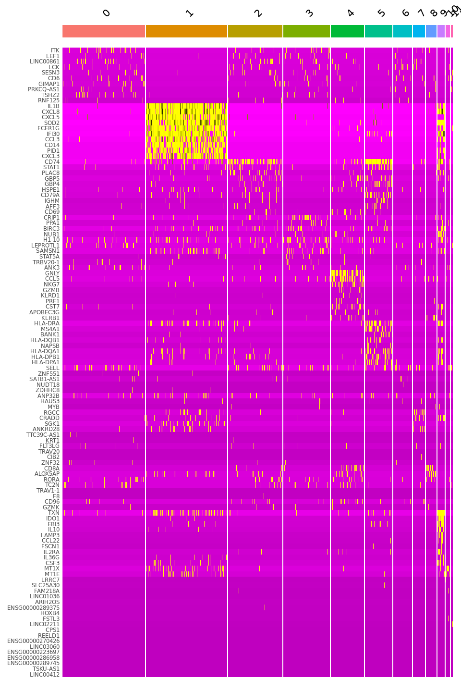
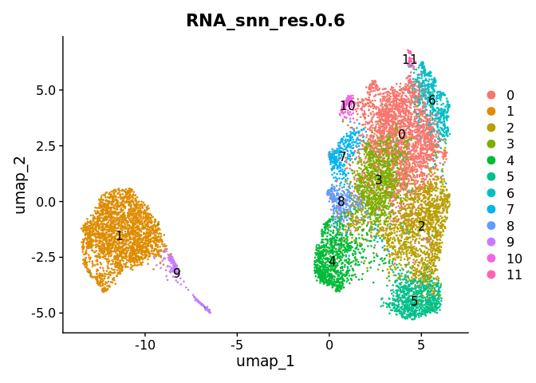
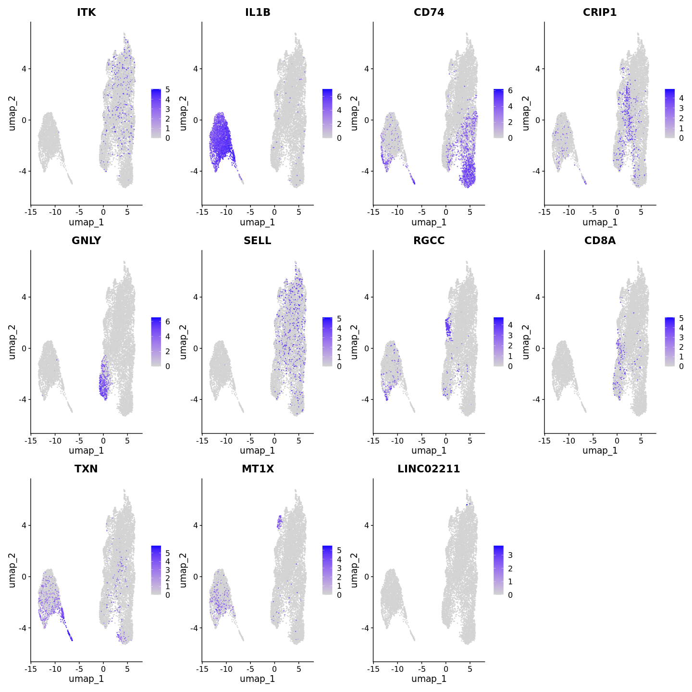
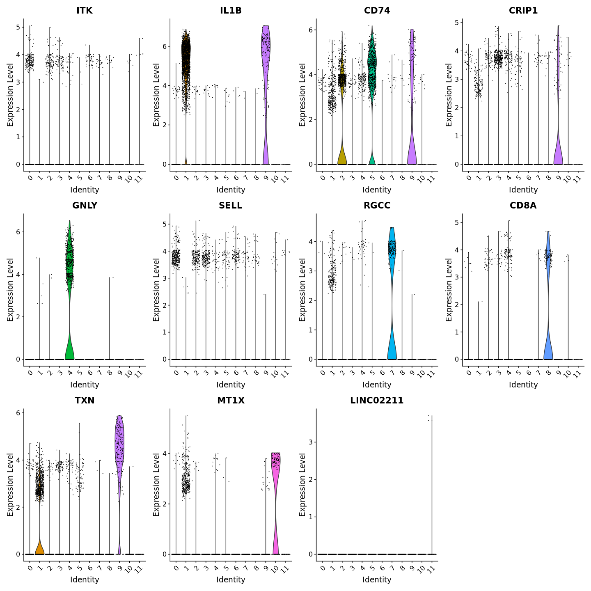
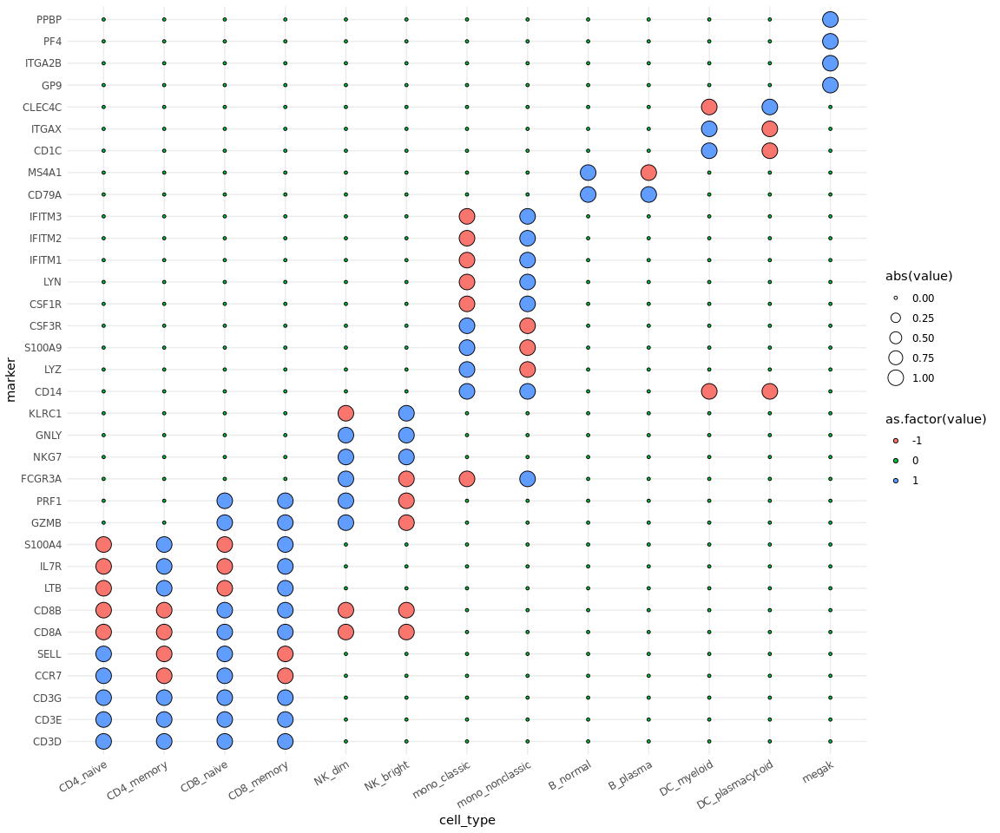
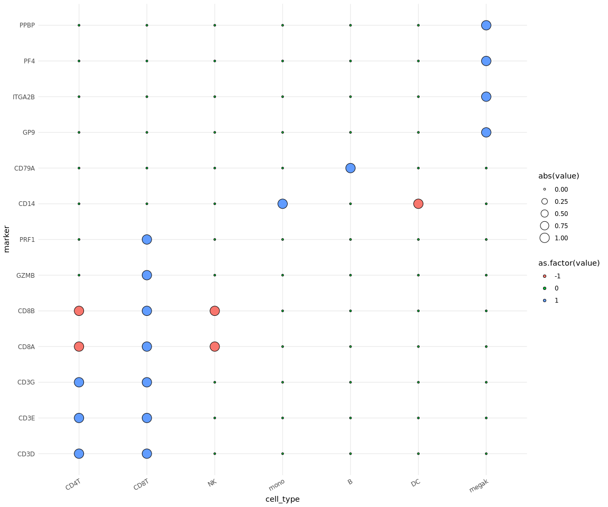
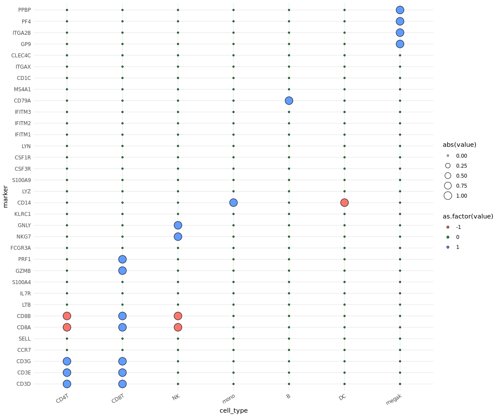
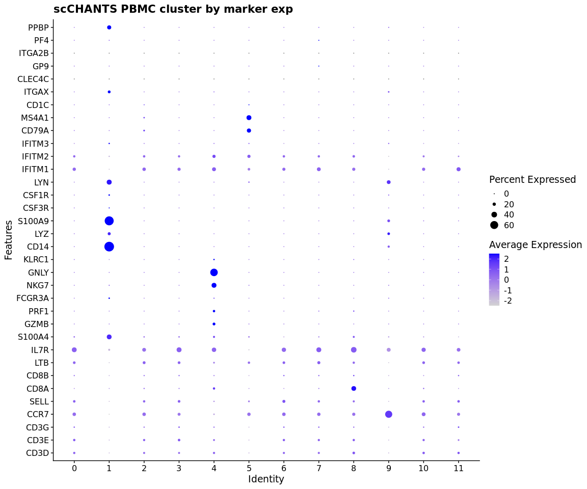

In script 1.11, we loaded, demultimplexed HTOs, filtered for QC, ran PCA, cell_types and UMAP.
The seurat object was then saved so it can be read in here without repeating any of the above steps.
We also ran find cluster biomarkers which was saved to a csv file that can now be read in

``` r
library("dplyr")
```

```
## 
## Attaching package: 'dplyr'
```

```
## The following objects are masked from 'package:stats':
## 
##     filter, lag
```

```
## The following objects are masked from 'package:base':
## 
##     intersect, setdiff, setequal, union
```

``` r
library("Seurat")
```

```
## Loading required package: SeuratObject
```

```
## Loading required package: sp
```

```
## 
## Attaching package: 'SeuratObject'
```

```
## The following objects are masked from 'package:base':
## 
##     intersect, t
```

``` r
library("ggplot2")
library("readr")
library("tidyr")
```

# Create file path for saving plots
Must create this directory and sub-directories e.g. demultiplex, QC, PCA, others

``` r
file_path <- "/scratch/prj/id_hill_sims_wellcda/scratch_tmp/scCHANTS/20250616_benchmark/plots/PBMC_plots"
```


``` r
# load seurat object
scCHANTS_pbmc <- readRDS("/cephfs/volumes/hpc_data_prj/id_hill_sims_wellcda/c1947608-5b3a-4d60-8179-b8e0779d7319/scratch_tmp/scCHANTS/20250616_benchmark/20250616_scCHANTS_pbmc_processed.Rds")

# check has pca and umap saved
names(scCHANTS_pbmc@reductions)
```

```
## [1] "pca"  "umap"
```

``` r
# check has RNA_snn_res column with cell_types
colnames(scCHANTS_pbmc@meta.data)
```

```
##  [1] "orig.ident"                "nCount_RNA"               
##  [3] "nFeature_RNA"              "nCount_HTO"               
##  [5] "nFeature_HTO"              "nCount_ADT"               
##  [7] "nFeature_ADT"              "HTO_maxID"                
##  [9] "HTO_secondID"              "HTO_margin"               
## [11] "HTO_classification"        "HTO_classification.global"
## [13] "hash.ID"                   "sample_id"                
## [15] "timepoint"                 "treatment"                
## [17] "PBMC_or_T"                 "percent_mt"               
## [19] "percent_rb"                "QC"                       
## [21] "RNA_snn_res.0.6"           "seurat_clusters"
```

``` r
Idents(scCHANTS_pbmc) <- "RNA_snn_res.0.6"

# load in cluster markers
pbmc_markers <- read_csv("/scratch/prj/id_hill_sims_wellcda/scratch_tmp/scCHANTS/20250616_benchmark/20250616_scCHANTS_pbmc_markers.csv")
```

```
## New names:
## Rows: 9268 Columns: 8
## ── Column specification
## ──────────────────────────────────────────────────────── Delimiter: "," chr
## (2): ...1, gene dbl (6): p_val, avg_log2FC, pct.1, pct.2, p_val_adj, cluster
## ℹ Use `spec()` to retrieve the full column specification for this data. ℹ
## Specify the column types or set `show_col_types = FALSE` to quiet this message.
## • `` -> `...1`
```

``` r
head(pbmc_markers)
```

```
## # A tibble: 6 × 8
##   ...1       p_val avg_log2FC pct.1 pct.2 p_val_adj cluster gene  
##   <chr>      <dbl>      <dbl> <dbl> <dbl>     <dbl>   <dbl> <chr> 
## 1 RPL34  1.24e-142      0.743 0.853 0.648 4.78e-138       0 RPL34 
## 2 RPL32  1.85e-123      0.734 0.808 0.602 7.15e-119       0 RPL32 
## 3 RPS12  1.42e-122      0.617 0.903 0.733 5.47e-118       0 RPS12 
## 4 RPS8   2.54e-122      0.645 0.884 0.727 9.80e-118       0 RPS8  
## 5 EEF1A1 7.82e-121      0.524 0.957 0.874 3.02e-116       0 EEF1A1
## 6 RPL13  2.95e-116      0.701 0.82  0.624 1.14e-111       0 RPL13
```

# Look at cluster markers


can also: Classification power, ROC test while running findmarkers returns value 0-1 (random-perfect classification) but requires join layers:
cluster0.markers <- FindMarkers(scCHANTS_pbmc, ident.1 = 0, logfc.threshold = 0.25, test.use = "roc", only.pos = TRUE)
    

``` r
pbmc_markers %>%
  group_by(cluster) %>%
  dplyr::filter(avg_log2FC > 1) %>% 
  arrange(avg_log2FC) %>% 
  head()
```

```
## # A tibble: 6 × 8
## # Groups:   cluster [4]
##   ...1         p_val avg_log2FC pct.1 pct.2 p_val_adj cluster gene    
##   <chr>        <dbl>      <dbl> <dbl> <dbl>     <dbl>   <dbl> <chr>   
## 1 MCL1     2.31e-117       1.00 0.201 0.045 8.90e-113       1 MCL1    
## 2 TUBB     9.72e-105       1.00 0.189 0.045 3.76e-100       1 TUBB    
## 3 CYLD     1.03e-  3       1.00 0.06  0.038 1   e+  0       4 CYLD    
## 4 ANK31    5.40e- 10       1.00 0.073 0.036 2.09e-  5       3 ANK3    
## 5 KRTCAP2  8.29e-  4       1.00 0.082 0.056 1   e+  0       4 KRTCAP2 
## 6 EPM2AIP1 1.01e-  4       1.00 0.035 0.008 1   e+  0       9 EPM2AIP1
```

``` r
top10 <- pbmc_markers %>%
    group_by(cluster) %>%
    dplyr::filter(avg_log2FC > 1) %>%
    slice_head(n = 10) %>% # take top 10 genes for each cluster
    ungroup()
top10
```

```
## # A tibble: 120 × 8
##    ...1         p_val avg_log2FC pct.1 pct.2 p_val_adj cluster gene     
##    <chr>        <dbl>      <dbl> <dbl> <dbl>     <dbl>   <dbl> <chr>    
##  1 ITK       2.81e-17       1.18 0.077 0.036  1.08e-12       0 ITK      
##  2 LEF1      3.70e-15       1.15 0.067 0.031  1.43e-10       0 LEF1     
##  3 LINC00861 3.23e-14       1.03 0.069 0.033  1.25e- 9       0 LINC00861
##  4 LCK       8.43e-13       1.10 0.067 0.033  3.25e- 8       0 LCK      
##  5 SESN3     2.07e-10       1.08 0.055 0.028  7.99e- 6       0 SESN3    
##  6 CD6       5.76e-10       1.05 0.048 0.023  2.22e- 5       0 CD6      
##  7 GIMAP1    5.56e- 9       1.02 0.051 0.027  2.15e- 4       0 GIMAP1   
##  8 PRKCQ-AS1 6.68e- 9       1.13 0.039 0.018  2.58e- 4       0 PRKCQ-AS1
##  9 TSHZ2     7.01e- 8       1.09 0.037 0.019  2.71e- 3       0 TSHZ2    
## 10 RNF125    1.20e- 7       1.40 0.022 0.009  4.63e- 3       0 RNF125   
## # ℹ 110 more rows
```

``` r
c1 <- DoHeatmap(scCHANTS_pbmc, features = top10$gene) + 
  NoLegend()
c1
```

<!-- -->

``` r
# ggsave("top10_markers_heatmap.png", plot = c1, device = png, width = 17, height = 25, unit = "cm", path = paste0(file_path, "/cell_types/") )
```


``` r
c2 <- DimPlot(scCHANTS_pbmc, group.by = "RNA_snn_res.0.6", label = TRUE)
c2
```

<!-- -->

``` r
# ggsave("by_clusters_umap.png", plot = c2, device = png, width = 15, height = 10, unit = "cm", path = paste0(file_path, "/cell_types/") )
```


``` r
# 1 marker for each cluster
c3 <- FeaturePlot(scCHANTS_pbmc, features = c("ITK", "IL1B", "CD74", "CRIP1", "GNLY", "CD74", "SELL", "RGCC", "CD8A", "TXN", "MT1X", "LINC02211"))
c3
```

<!-- -->

``` r
# ggsave("top_marker_featureplots.png", plot = c3, device = png, width = 25, height = 20, unit = "cm", path = paste0(file_path, "/cell_types/") )

c4 <- VlnPlot(scCHANTS_pbmc, features = c("ITK", "IL1B", "CD74", "CRIP1", "GNLY", "CD74", "SELL", "RGCC", "CD8A", "TXN", "MT1X", "LINC02211"))
c4
```

<!-- -->

``` r
# ggsave("top_marker_vlnplots.png", plot = c4, device = png, width = 25, height = 20, unit = "cm", path = paste0(file_path, "/cell_types/") )
```

# Load known broad cell type markers in, make dotplot


``` r
# plot dotplot of expected cell types for markers
# read in binary tables for specific and broad cell types
markers_binary_sp <- read.csv("/scratch/prj/id_hill_sims_wellcda/1M-scBloodNL/marker_genes/marker_genes_binary_specificcelltypes.csv")

markers_binary_br <- read.csv("/scratch/prj/id_hill_sims_wellcda/1M-scBloodNL/marker_genes/marker_genes_binary_broadcelltypes.csv")

# has only broad cell types but all gene markers so can compare directly
markers_binary_br2 <- read.csv("/scratch/prj/id_hill_sims_wellcda/1M-scBloodNL/marker_genes/marker_genes_binary_broadcelltypes_allmarkers.csv")

# make into long format so can plot dotplot
markers_long_sp <- markers_binary_sp %>%
  pivot_longer(
    cols = -marker,
    names_to = "cell_type",
    values_to = "value"
  ) %>% 
  mutate(marker = factor(marker,
                         levels = c("CD3D", "CD3E", "CD3G", "CCR7", "SELL", "CD8A", "CD8B", "LTB", "IL7R", "S100A4", "GZMB", "PRF1", "FCGR3A", "NKG7", "GNLY", "KLRC1", "CD14", "LYZ", "S100A9", "CSF3R", "CSF1R", "LYN", "IFITM1", "IFITM2", "IFITM3", "CD79A", "MS4A1", "CD1C", "ITGAX", "CLEC4C", "GP9", "ITGA2B", "PF4", "PPBP")),
          cell_type = factor(cell_type,
                             levels = c("CD4_naive", "CD4_memory", "CD8_naive", "CD8_memory", "NK_dim", "NK_bright", "mono_classic", "mono_nonclassic", "B_normal", "B_plasma", "DC_myeloid", "DC_plasmacytoid", "megak")))

markers_long_br <- markers_binary_br %>%
  pivot_longer(
    cols = -marker,
    names_to = "cell_type",
    values_to = "value"
  ) %>% 
  mutate(marker = factor(marker,
                         levels = c("CD3D", "CD3E", "CD3G", "CD8A", "CD8B", "GZMB", "PRF1", "CD14", "CD79A", "GP9", "ITGA2B", "PF4", "PPBP")),
         cell_type = factor(cell_type,
                             levels = c("CD4T", "CD8T", "NK", "mono", "B", "DC", "megak")))

markers_long_br2 <- markers_binary_br2 %>%
  pivot_longer(
    cols = -marker,
    names_to = "cell_type",
    values_to = "value"
  ) %>% 
  mutate(marker = factor(marker,
                         levels = c("CD3D", "CD3E", "CD3G", "CCR7", "SELL", "CD8A", "CD8B", "LTB", "IL7R", "S100A4", "GZMB", "PRF1", "FCGR3A", "NKG7", "GNLY", "KLRC1", "CD14", "LYZ", "S100A9", "CSF3R", "CSF1R", "LYN", "IFITM1", "IFITM2", "IFITM3", "CD79A", "MS4A1", "CD1C", "ITGAX", "CLEC4C", "GP9", "ITGA2B", "PF4", "PPBP")),
          cell_type = factor(cell_type,
                             levels = c("CD4T", "CD8T", "NK", "mono", "B", "DC", "megak")))
```


``` r
p1 <- ggplot(markers_long_sp, aes(x = marker, y = cell_type)) +
  geom_point(aes(size = abs(value), fill = as.factor(value)), shape = 21, color = "black") +
  coord_flip() +
  theme_minimal() +
  theme(axis.text.x = element_text(angle = 30, vjust = 1, hjust=1))
p1
```

<!-- -->

``` r
# ggsave("specific_celltype_by_markerexp_dotplot.png", plot = p1, device = png, width = 16, height = 12, unit = "cm", bg = "white", path = paste0(file_path, "/cell_types/markers") )

p2 <- ggplot(markers_long_br, aes(x = marker, y = cell_type)) +
  geom_point(aes(size = abs(value), fill = as.factor(value)), shape = 21, color = "black") +
  coord_flip() +
  theme_minimal() +
  theme(axis.text.x = element_text(angle = 30, vjust = 1, hjust=1))
p2
```

<!-- -->

``` r
# ggsave("broad_celltype_by_markerexp_dotplot.png", plot = p2, device = png, width = 16, height = 12, unit = "cm", bg = "white", path = paste0(file_path, "/cell_types/markers") )

p3 <- ggplot(markers_long_br2, aes(x = marker, y = cell_type)) +
  geom_point(aes(size = abs(value), fill = as.factor(value)), shape = 21, color = "black") +
  coord_flip() +
  theme_minimal() +
  theme(axis.text.x = element_text(angle = 30, vjust = 1, hjust=1))
p3
```

<!-- -->

``` r
# ggsave("broad_celltype_by_allmarkerexp_dotplot.png", plot = p3, device = png, width = 16, height = 12, unit = "cm", bg = "white", path = paste0(file_path, "/cell_types/markers") )
```


``` r
marker_genes <- c("CD3D", "CD3E", "CD3G", "CCR7", "SELL", "CD8A", "CD8B", "LTB", "IL7R", "S100A4", "GZMB", "PRF1", "FCGR3A", "NKG7", "GNLY", "KLRC1", "CD14", "LYZ", "S100A9", "CSF3R", "CSF1R", "LYN", "IFITM1", "IFITM2", "IFITM3", "CD79A", "MS4A1", "CD1C", "ITGAX", "CLEC4C", "GP9", "ITGA2B", "PF4", "PPBP")

c5 <- DotPlot(scCHANTS_pbmc, features = marker_genes, assay = "RNA", group.by = "RNA_snn_res.0.6", cols = c("lightgrey", "blue")) +
  coord_flip() +
  ggtitle("scCHANTS PBMC cluster by marker exp")
c5
```

<!-- -->

``` r
# ggsave("clusters_by_markerexp_dotplot.png", plot = c5, device = png, width = 20, height = 14, unit = "cm", bg = "white", path = paste0(file_path, "/cell_types/") )
```

